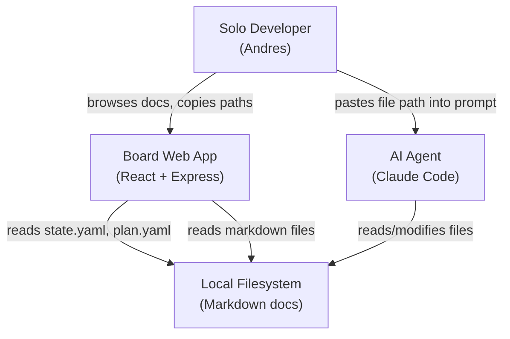
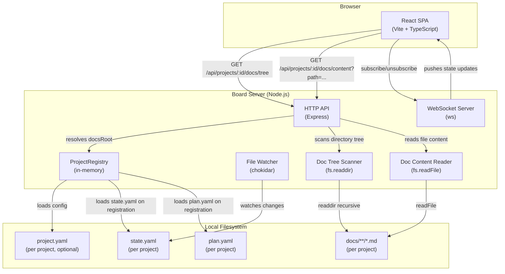
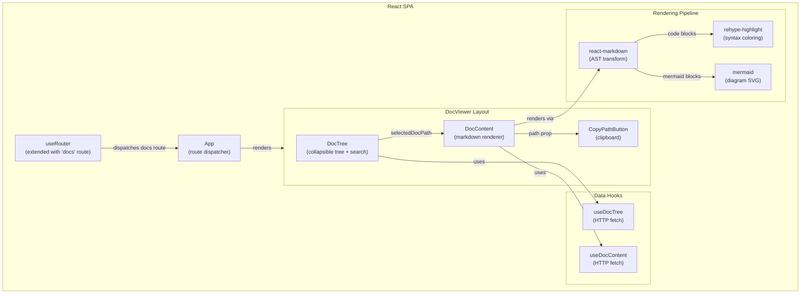
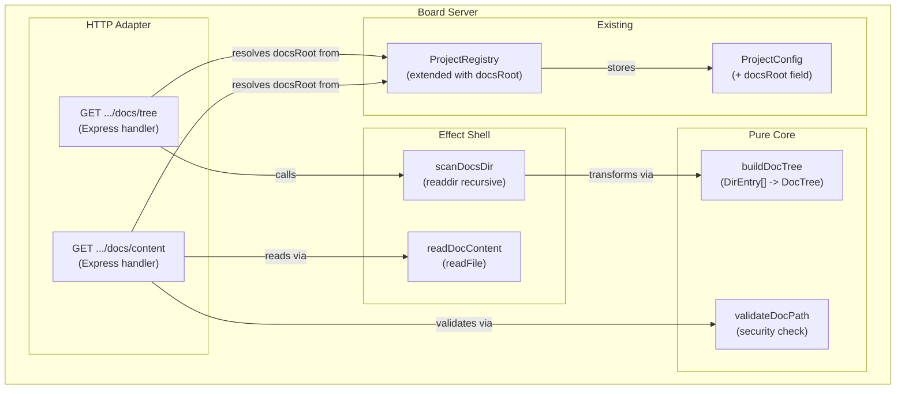

# Architecture Design: Documentation Viewer (doc-viewer)

## System Overview

Read-only documentation browser integrated into the existing board web app. Extends the current multi-project architecture with two HTTP endpoints and a new frontend route. No WebSocket extension needed — doc content is request-response, not real-time.

## C4 System Context (L1)

## C4 Container (L2)

## C4 Component (L3) — Doc Viewer Frontend

## C4 Component (L3) — Doc Server Modules

## Integration with Existing Architecture

### What Changes

| Component | Change | Rationale |
|-----------|--------|-----------|
| `ProjectConfig` | Add optional `docsRoot: string` | Enable per-project docs directory |
| `toConfig()` in multi-project-server | Derive `docsRoot` from `project.yaml` or convention | Auto-discovery of docs root |
| `createMultiProjectHttpApp` | Add 2 doc endpoints | Serve tree and content |
| `MultiProjectHttpDeps` | Add `getProjectConfig` | Endpoints need `docsRoot` |
| `useRouter` / `Route` | Add `docs` route variant | New view type |
| `App.tsx` | Handle `docs` route, add tab navigation | Route dispatch |
| `shared/types.ts` | Add `DocNode`, `DocTree`, error types | Shared type definitions |

### What Does NOT Change

- WebSocket protocol (docs are HTTP-only, not real-time)
- File watcher (state.yaml watching unchanged)
- Discovery polling (project discovery unchanged)
- Parser (YAML parsing unchanged)
- Differ (state diffing unchanged)
- Existing board components (KanbanBoard, ProgressHeader, etc.)

### Docs Root Resolution Strategy

1. When `toConfig(projectId)` builds a `ProjectConfig`, it checks for `{projectsRoot}/{projectId}/project.yaml`
2. If `project.yaml` exists and contains `docs_root`, use that value (absolute or relative to project state dir)
3. If no `project.yaml`, default `docsRoot` to `undefined` (docs endpoints return empty tree)
4. `docsRoot` is stored in `ProjectConfig` and accessible via `ProjectRegistry.get()`

This approach is explicit (no magic path guessing), configurable per project, and degrades gracefully.

## FP Architecture Patterns Applied

### Pure Core / Effect Shell

| Layer | Examples | Purity |
|-------|----------|--------|
| Pure core | `buildDocTree`, `validateDocPath`, `filterTree`, `parseHash` | No side effects |
| Effect shell | `scanDocsDir`, `readDocContent` | Filesystem IO |
| Adapter | Express handlers, React hooks | HTTP/DOM IO |

### Types-First Design

All domain types defined as algebraic data types (discriminated unions) before implementation:
- `DocNode = File | Directory` (sum type)
- `DocTree` (product type with metadata)
- `DocTreeError`, `DocContentError` (error sum types)
- `Result<T, E>` (existing railway type reused)

### Composition Pipelines

Server: `request -> validateProjectId -> resolveDocsRoot -> scanDocsDir -> buildDocTree -> response`
Client: `rawMarkdown -> react-markdown AST -> rehype-highlight -> mermaid render -> React elements`

### Immutable State

All types use `readonly` modifiers. Client state via React hooks (immutable updates). No mutable shared state.

## Security Considerations

### Path Traversal Prevention

The `validateDocPath` function MUST:
1. Normalize the requested path
2. Resolve it against `docsRoot`
3. Verify the resolved path starts with `docsRoot` (no `../` escape)
4. Reject paths containing null bytes

This is the only security-critical function in the feature. It lives in the pure core for easy unit testing.

## Error Handling Strategy

| Error | Server Response | Client Behavior |
|-------|-----------------|-----------------|
| Project not found | 404 | Show "Project not found" |
| No docsRoot configured | 200, empty tree | Show "No documentation found" |
| docsRoot directory missing | 200, empty tree | Show "No documentation found" |
| Doc file not found | 404 | Show "Could not load" + retry |
| Path traversal attempt | 400 | Show generic error |
| Malformed markdown | N/A (client-side) | Best-effort rendering |
| Mermaid parse failure | N/A (client-side) | Show raw code block |

## Deployment

No changes to deployment. Same `npm run dev` / `npm run build` workflow. New npm dependencies added to `board/package.json`. Vite proxy config unchanged (all doc endpoints use existing `/api` prefix).
