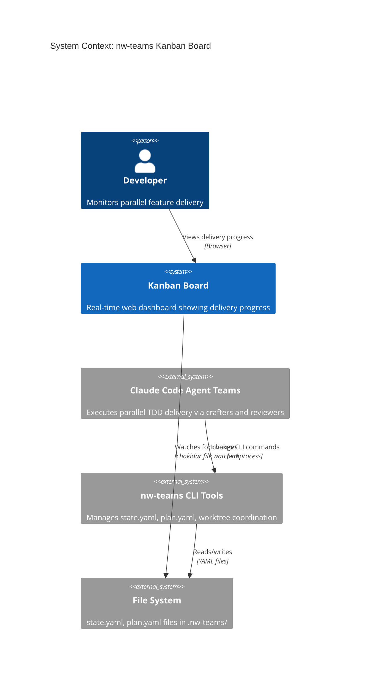
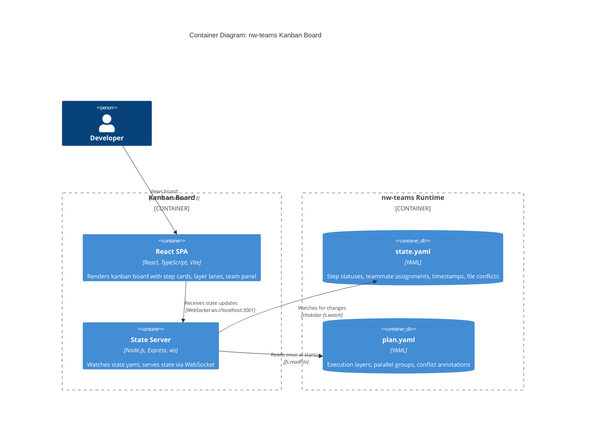
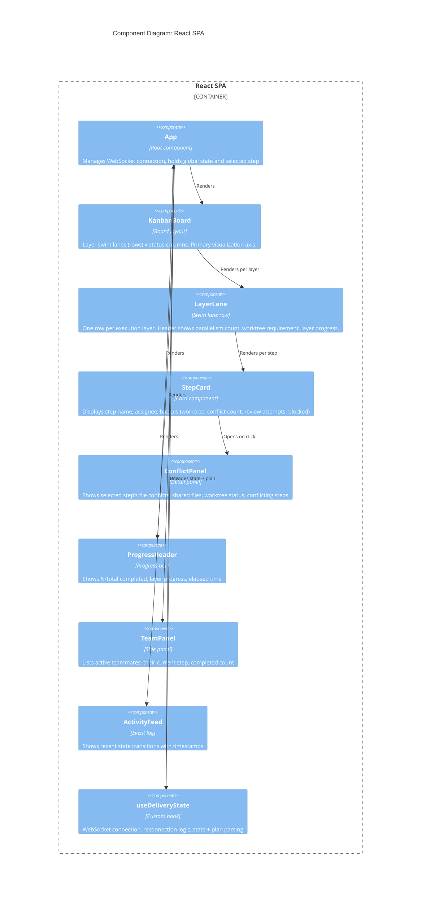
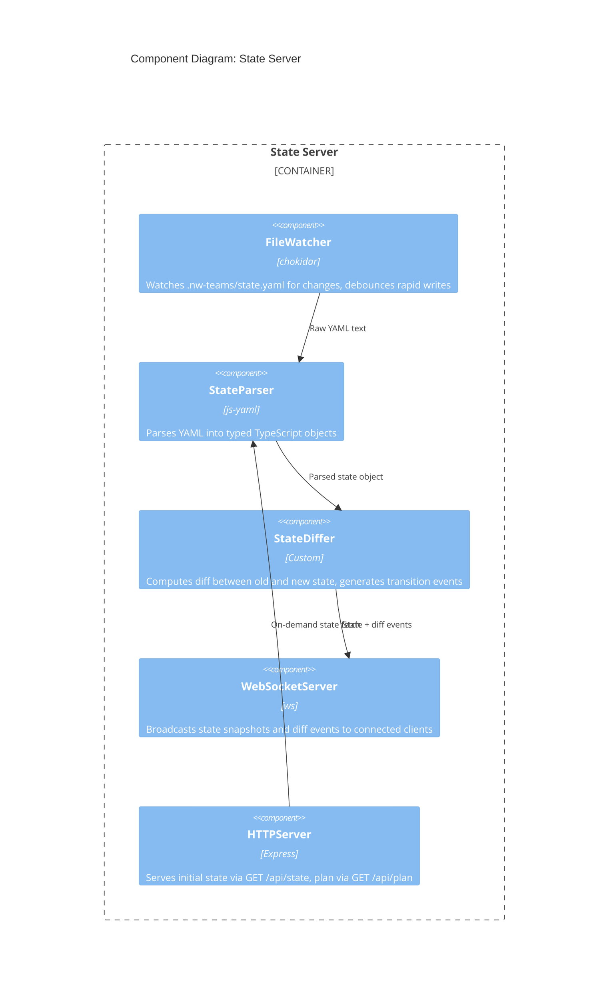

# Architecture Design: Kanban Board for nw-teams:execute

## 1. Business Drivers

| Driver | Priority | Rationale |
|--------|----------|-----------|
| Real-time monitoring | High | Users need live visibility into parallel agent delivery |
| Visual polish | High | Professional, polished UI that communicates state at a glance |
| Low integration risk | High | Must not interfere with existing CLI tools or agent orchestration |
| Time-to-market | Medium | Standalone tool — can ship independently |

## 2. Quality Attributes

- **Observability**: The board is read-only — it observes state, never mutates it
- **Responsiveness**: Sub-second updates when state.yaml changes
- **Simplicity**: Minimal moving parts — file watcher + WebSocket + React
- **Independence**: Zero coupling to agent runtime; works by reading the same state.yaml the CLI writes

## 3. Architecture Decision: File Watching over Event Streams

**Decision**: Watch `.nw-teams/state.yaml` for changes rather than adding event emission to CLI tools.

**Rationale**:
- The CLI tools (`team_state update`) already write structured YAML after every state transition
- File watching is a zero-modification integration — no changes to `team_state.py` needed
- The state file is the source of truth; the board mirrors it
- If the board crashes or isn't running, delivery continues unaffected

**Trade-off**: Slightly less granular than real-time events (we see state snapshots, not individual transitions). This is acceptable because state transitions happen seconds apart, not milliseconds.

## 4. System Architecture

### C4 System Context Diagram



### C4 Container Diagram



### C4 Component Diagram — React SPA



### C4 Component Diagram — State Server



## 5. Data Flow

```
state.yaml written by CLI
        │
        ▼
   FileWatcher (chokidar, 100ms debounce)
        │
        ▼
   StateParser (YAML → TypeScript types)
        │
        ▼
   StateDiffer (compare prev vs curr state)
        │
        ├──► WebSocket broadcast: { type: "state", data: fullState }
        └──► WebSocket broadcast: { type: "transition", data: { stepId, from, to, timestamp } }
              │
              ▼
        useDeliveryState hook (React) — exposes state + plan
              │
              ├──► KanbanBoard (layer swim lanes × status columns)
              │     └──► LayerLane (header: parallelism, worktree req, progress)
              │           └──► StepCard (badges: 🌳 worktree, ⚡ conflicts, r: reviews, 🔒 blocked)
              │                 └──► ConflictPanel (on click: shared files, conflicting steps, worktree branch)
              ├──► ProgressHeader (completion %, layer progress)
              ├──► TeamPanel (active agents)
              └──► ActivityFeed (transition history)
```

## 6. Kanban Board Layout

The board uses **layer swim lanes** as the primary axis (rows = execution layers, columns = status).
This makes parallelism structural: multiple cards in the same row = parallel execution.

```
┌─────────────────────────────────────────────────────────────────────────────────────────────┐
│  nw-teams:execute — auth-feature                                    5/8 steps ██████░░ 62%  │
├───────────────┬──────────┬──────────┬──────────┬──────────┬──────────┬───────────────────────┤
│               │ PENDING  │ WORKING  │ REVIEW   │ APPROVED │ FAILED   │                       │
├───────────────┼──────────┼──────────┼──────────┼──────────┼──────────┤  Team Panel            │
│ Layer 1       │          │          │          │ ┌──────┐ │          │                       │
│ 3 parallel    │          │          │          │ │01-01 │ │          │  crafter-02-01         │
│               │          │          │          │ │User  │ │          │   → step 02-01         │
│ 3/3 done      │          │          │          │ │model │ │          │                       │
│               │          │          │          │ └──────┘ │          │  crafter-02-03         │
│               │          │          │          │ ┌──────┐ │          │   → step 02-03         │
│               │          │          │          │ │01-02 │ │          │                       │
│               │          │          │          │ │User  │ │          │  reviewer-02-02        │
│               │          │          │          │ │repo  │ │          │   → reviewing          │
│               │          │          │          │ └──────┘ │          │                       │
│               │          │          │          │ ┌──────┐ │          │───────────────────────│
│               │          │          │          │ │01-03 │ │          │  Activity              │
│               │          │          │          │ │User  │ │          │                       │
│               │          │          │          │ │svc   │ │          │  14:32 02-02           │
│               │          │          │          │ └──────┘ │          │   working → review     │
├───────────────┼──────────┼──────────┼──────────┼──────────┼──────────┤                       │
│ Layer 2       │ ┌──────┐ │ ┌──────┐ │ ┌──────┐ │          │          │  14:30 01-03           │
│ 4 parallel    │ │02-04 │ │ │02-01 │ │ │02-02 │ │          │          │   review → approved    │
│ WORKTREES     │ │User  │ │ │Auth  │ │ │Token │ │          │          │                       │
│               │ │ctrl  │ │ │midw  │ │ │svc   │ │          │          │  14:28 02-01           │
│ 0/4 done      │ └──────┘ │ │🌳 ⚡2│ │ │🌳 r:2│ │          │          │   pending → working    │
│               │          │ └──────┘ │ └──────┘ │          │          │                       │
│               │          │ ┌──────┐ │          │          │          │                       │
│               │          │ │02-03 │ │          │          │          │                       │
│               │          │ │Repo  │ │          │          │          │                       │
│               │          │ │svc   │ │          │          │          │                       │
│               │          │ └──────┘ │          │          │          │                       │
├───────────────┼──────────┼──────────┼──────────┼──────────┼──────────┤                       │
│ Layer 3       │ ┌──────┐ │          │          │          │          │                       │
│ 1 sequential  │ │03-01 │ │          │          │          │          │                       │
│               │ │Ctrl  │ │          │          │          │          │                       │
│ blocked by L2 │ │🔒    │ │          │          │          │          │                       │
│               │ └──────┘ │          │          │          │          │                       │
└───────────────┴──────────┴──────────┴──────────┴──────────┴──────────┴───────────────────────┘

Layer header anatomy:
┌───────────────┐
│ Layer 2       │  ← layer number
│ 4 parallel    │  ← parallelism (N parallel / 1 sequential)
│ WORKTREES     │  ← worktree badge (if layer has file conflicts)
│ 0/4 done      │  ← layer progress
└───────────────┘

Card anatomy:
┌────────────────┐
│ 02-01          │  ← step_id
│ Auth middleware │  ← step name (truncated)
│ crafter-02-01  │  ← assignee
│ 🌳 ⚡2         │  ← badges: 🌳 worktree | ⚡N file conflicts | r:N review attempts
│ 3 files        │  ← files_to_modify count
└────────────────┘

Badges:
  🌳  = step runs in worktree isolation
  ⚡N = step has N file conflicts with other steps (click for detail)
  r:N = review attempt count (shown when > 0)
  🔒  = step blocked by unfinished dependencies

Conflict Detail Panel (appears on card click):
┌─────────────────────────────────────┐
│ Step 02-01: Auth middleware         │
│                                     │
│ Worktree: active                    │
│ Branch: worktree-crafter-02-01      │
│                                     │
│ File Conflicts (2 steps):           │
│ ┌─────────────────────────────────┐ │
│ │ ⚡ 02-02 (Token svc)            │ │
│ │   Shared: src/app.ts            │ │
│ │   Status: review                │ │
│ ├─────────────────────────────────┤ │
│ │ ⚡ 02-04 (User ctrl)            │ │
│ │   Shared: src/app.ts            │ │
│ │   Status: pending               │ │
│ └─────────────────────────────────┘ │
│                                     │
│ Files modified:                     │
│   src/middleware/auth.ts            │
│   src/middleware/auth.test.ts       │
│   src/app.ts                        │
└─────────────────────────────────────┘
```

## 7. Technology Stack

| Component | Technology | Rationale |
|-----------|-----------|-----------|
| Frontend framework | React 19 + TypeScript | User preference; excellent for reactive UIs |
| Build tool | Vite | Fast dev server, instant HMR |
| Styling | Tailwind CSS | Rapid visual polish without custom CSS overhead |
| DnD / layout | None (read-only board) | Cards are positioned by state, not dragged |
| WebSocket client | Native WebSocket API | No library needed for simple subscription |
| Backend runtime | Node.js | Same language as frontend; single `npx` to run |
| File watcher | chokidar | Battle-tested, cross-platform fs watcher |
| YAML parser | js-yaml | Standard YAML parser for Node.js |
| WebSocket server | ws | Lightweight, no framework overhead |
| HTTP server | Express | Serves initial state + SPA static files in production |
| Monorepo | Single package | Small enough scope; no need for workspaces |

## 8. Project Structure

```
board/
├── package.json
├── tsconfig.json
├── vite.config.ts
├── server/
│   ├── index.ts              # Entry: Express + WebSocket + file watcher
│   ├── watcher.ts            # chokidar file watcher with debounce
│   ├── parser.ts             # YAML → typed state objects
│   ├── differ.ts             # State diff computation
│   └── types.ts              # Shared TypeScript types (state, plan, events)
├── src/
│   ├── main.tsx              # React entry point
│   ├── App.tsx               # Root: WebSocket connection + layout
│   ├── hooks/
│   │   └── useDeliveryState.ts  # WebSocket hook with reconnection
│   ├── components/
│   │   ├── KanbanBoard.tsx   # Layer swim lanes × status columns
│   │   ├── LayerLane.tsx     # Swim lane row with parallelism/worktree header
│   │   ├── StepCard.tsx      # Card with conflict/worktree/review badges
│   │   ├── ConflictPanel.tsx # Detail panel for selected step's conflicts
│   │   ├── ProgressHeader.tsx # Overall progress bar
│   │   ├── TeamPanel.tsx     # Active teammates sidebar
│   │   └── ActivityFeed.tsx  # Recent transition log
│   ├── utils/
│   │   └── statusColors.ts   # Status → color/icon mapping
│   └── types.ts              # Frontend-specific types
└── public/
    └── index.html
```

## 9. Key Design Decisions

### ADR-001: File Watching over Event Emission

**Context**: Need real-time data from the delivery process to the kanban board.

**Options considered**:
1. **Watch state.yaml** — Poll/watch the file the CLI already writes
2. **Add event emission to CLI** — Modify `team_state.py` to emit events (stdout, socket, file-based queue)
3. **Shared database** — SQLite or similar between CLI and board

**Decision**: Option 1 — File watching.

**Consequences**:
- (+) Zero changes to existing CLI tools
- (+) Board is fully decoupled — can be added/removed without affecting delivery
- (+) Single source of truth (state.yaml) — no sync issues
- (-) Slightly coarser granularity than real-time events (snapshot-based)
- (-) Debounce needed for rapid successive writes

### ADR-002: WebSocket over SSE

**Context**: Need to push state updates from server to browser.

**Options considered**:
1. **WebSocket** — Bidirectional, low overhead
2. **Server-Sent Events (SSE)** — Unidirectional, simpler protocol
3. **Polling** — HTTP GET every N seconds

**Decision**: WebSocket.

**Consequences**:
- (+) Lower latency than polling
- (+) Bidirectional — future-proofs for interactive features (manual step retry, etc.)
- (+) Single connection per client
- (-) Slightly more complex than SSE (but `ws` library handles it)

### ADR-003: Read-Only Board (No Drag-and-Drop)

**Context**: Should users be able to interact with the board (move cards, trigger actions)?

**Decision**: Read-only. Cards are positioned by their status in state.yaml, not by user interaction.

**Rationale**: The delivery process is orchestrated by the Lead agent. Manual intervention would conflict with the agent's state management. If we add interactivity later, it would be through CLI commands that the board proxies, not direct state mutation.

### ADR-004: Monolithic Single-Package Structure

**Context**: Should this be a separate npm package, a monorepo workspace, or embedded in nw-teams?

**Decision**: Single package inside a `board/` directory within nw-teams.

**Rationale**: The board is tightly coupled to nw-teams' state format. Keeping it in the same repo ensures type definitions stay in sync. It's small enough that workspaces add overhead without benefit.

## 10. Integration Points

| Integration | Direction | Mechanism |
|-------------|-----------|-----------|
| state.yaml | Board reads | chokidar file watch |
| plan.yaml | Board reads | One-time read at startup |
| CLI tools | None | Board never invokes CLI tools |
| Agent Teams | None | Board never communicates with agents |
| Git worktrees | Read-only | Board shows worktree badge from state data |

## 11. Startup Flow

```bash
# From the nw-teams project root, during an active delivery:
cd board && npm run dev

# This starts:
# 1. Vite dev server on localhost:5173 (React SPA)
# 2. State server on localhost:3001 (WebSocket + file watcher)
# Both start from a single npm script using concurrently
```

The server auto-detects `.nw-teams/state.yaml` relative to `process.cwd()/../` (the parent nw-teams project root). If no state file exists yet, the board shows a "Waiting for delivery to start..." placeholder.
