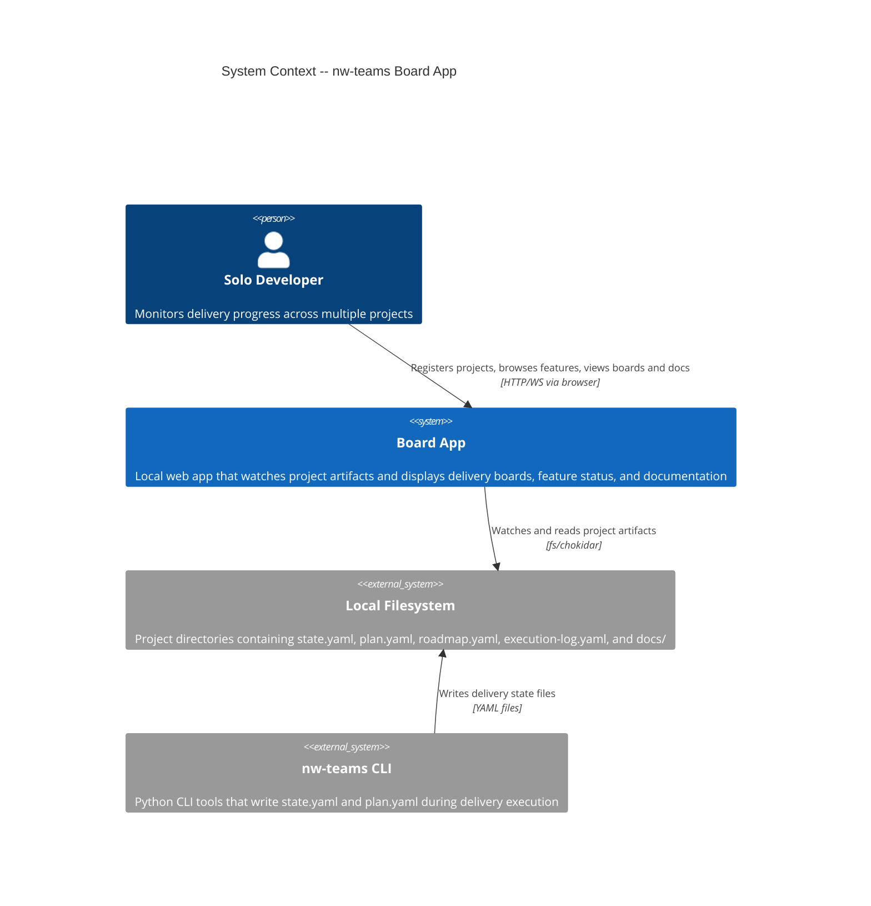
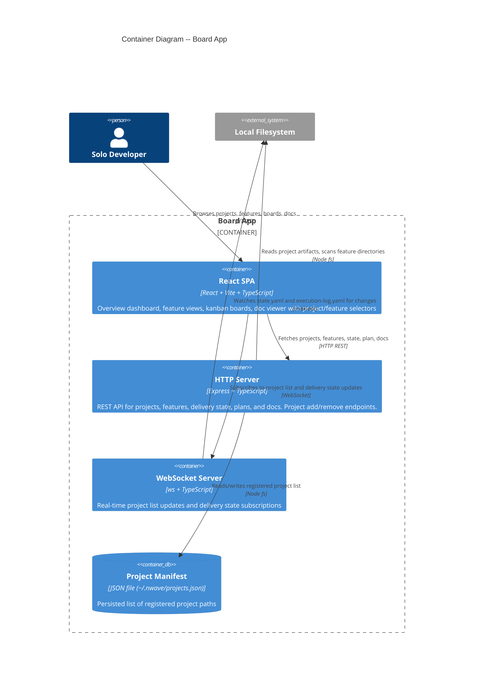
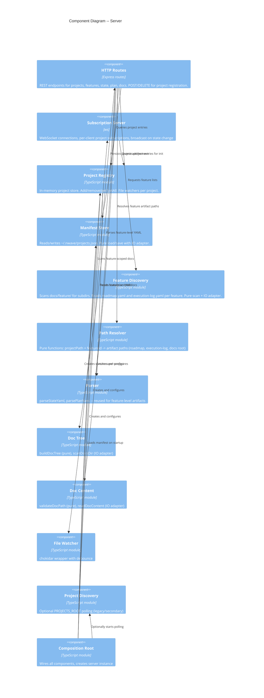
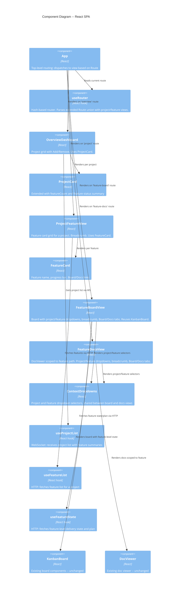

# Multi-Project Selector -- Architecture Design

## System Context

The board app is a local development monitoring tool for a solo developer. It watches project artifacts on the filesystem and presents delivery state through a browser UI. The multi-project-selector feature extends the existing single-project-root model to support arbitrary filesystem paths and per-feature navigation.

### Capabilities

- Register/unregister projects from arbitrary filesystem paths via UI
- Discover features within each project by scanning `docs/feature/` directories
- Navigate hierarchy: Projects > Features > Board/Docs
- Switch project/feature via dropdowns without navigating back
- Persist project manifest across server restarts

### C4 System Context (L1)



### C4 Container (L2)



### C4 Component -- Server (L3)



### C4 Component -- Client (L3)



## Component Architecture

### Server -- New Modules

| Module | Type | Responsibility |
|--------|------|----------------|
| `manifest-store.ts` | Pure + IO adapter | Load/save `~/.nwave/projects.json`. Pure: validate manifest schema, transform entries. IO: read/write JSON file. |
| `feature-discovery.ts` | Pure + IO adapter | Scan `docs/feature/` subdirectories. Pure: filter, summarize features. IO: readdir, read YAML files. |
| `feature-path-resolver.ts` | Pure | Map `(projectPath, featureId)` to artifact paths: roadmap.yaml, execution-log.yaml, docs root. |

### Server -- Modified Modules

| Module | Changes |
|--------|---------|
| `index.ts` | Add POST/DELETE `/api/projects`, GET `/api/projects/:id/features`, GET `/api/projects/:id/features/:featureId/state\|plan\|docs/tree\|docs/content`. Add express.json() middleware. |
| `multi-project-server.ts` | Wire manifest store (load on startup, save on add/remove). Wire feature discovery deps. Extend `toConfig` to use manifest paths. Support optional PROJECTS_ROOT coexistence. |
| `shared/types.ts` | Add `FeatureSummary`, `FeatureId` branded type, `ManifestEntry`, `ProjectManifest`. Extend `ProjectSummary` with `featureCount` and `features`. Extend `ProjectConfig` with `projectPath`. |

### Client -- New Components

| Component | Responsibility |
|-----------|----------------|
| `ProjectFeatureView` | Feature card grid for a project at `#/projects/{projectId}`. Breadcrumb, empty state. |
| `FeatureCard` | Feature name, progress bar, Board/Docs action links. |
| `FeatureBoardView` | Wraps KanbanBoard with project/feature dropdowns, breadcrumb, Board/Docs tabs. |
| `FeatureDocsView` | Wraps DocViewer scoped to feature. Project/feature dropdowns, breadcrumb, Board/Docs tabs. |
| `ContextDropdowns` | Shared project and feature dropdown selectors. Emits navigation on selection change. |
| `Breadcrumb` | Renders `Overview / {project} / {feature}` with clickable segments. |
| `AddProjectDialog` | Path input (text field + native picker where supported) for registering a project. |

### Client -- New Hooks

| Hook | Responsibility |
|------|----------------|
| `useFeatureList` | Fetches `GET /api/projects/{projectId}/features` via HTTP. Returns `FeatureSummary[]`. |
| `useFeatureState` | Fetches feature-level `state` and `plan` via HTTP. Returns `DeliveryState` and `ExecutionPlan`. |
| `useAddProject` | POST `/api/projects` with path. Returns result/error. |
| `useRemoveProject` | DELETE `/api/projects/:id`. Returns result/error. |

### Client -- Modified Modules

| Module | Changes |
|--------|---------|
| `useRouter.ts` | Extend Route union with `project`, `feature-board`, `feature-docs` views. Extend `parseHash` regex patterns. |
| `useProjectList.ts` | No structural change; receives extended `ProjectSummary` with `featureCount` and `features`. |
| `ProjectCard.tsx` | Display `featureCount` and aggregated feature status. Navigate to `#/projects/{projectId}` on click. |
| `OverviewDashboard.tsx` | Add "Add Project" button. Handle empty state with call-to-action. |
| `App.tsx` | Route dispatch for new views (`project`, `feature-board`, `feature-docs`). |

## Integration Patterns

### REST API Design

All endpoints use JSON. Error responses follow `{ error: string }` pattern.

#### Existing (unchanged)
- `GET /api/projects` -- returns `ProjectSummary[]` (now with `featureCount`, `features`)
- `GET /api/projects/:id/state` -- project-root DeliveryState
- `GET /api/projects/:id/plan` -- project-root ExecutionPlan
- `GET /api/projects/:id/docs/tree` -- project-root DocTree
- `GET /api/projects/:id/docs/content?path=...` -- project-root doc content

#### New: Project Management
- `POST /api/projects` -- body: `{ path: string }`. Validates path, derives projectId from folder name, registers. Returns `ProjectSummary` on success, `{ error: string }` on failure (400 for invalid path, 409 for duplicate).
- `DELETE /api/projects/:id` -- unregisters project. Returns 204 on success, 404 if not found.

#### New: Feature Discovery
- `GET /api/projects/:id/features` -- returns `FeatureSummary[]`. Scans `docs/feature/` on-demand (small scale, no caching needed for 1-5 features).

#### New: Feature-Level Artifacts
- `GET /api/projects/:id/features/:featureId/state` -- reads `execution-log.yaml` from `docs/feature/{featureId}/`. Returns DeliveryState. Returns 404 if file missing (not an error -- delivery not started).
- `GET /api/projects/:id/features/:featureId/plan` -- reads `roadmap.yaml` from `docs/feature/{featureId}/`. Returns ExecutionPlan. Returns 404 if missing.
- `GET /api/projects/:id/features/:featureId/docs/tree` -- DocTree scoped to `docs/feature/{featureId}/`.
- `GET /api/projects/:id/features/:featureId/docs/content?path=...` -- doc content from feature-scoped docs root.

### WebSocket Protocol

#### Existing messages (unchanged)
- Server -> Client: `project_list`, `init`, `update`, `project_removed`, `parse_error`
- Client -> Server: `subscribe`, `unsubscribe`

#### Extension: Feature-aware `ProjectSummary`
The `project_list` message already sends `ProjectSummary[]`. The extended `ProjectSummary` includes `featureCount` and `features` fields. No new message types needed for feature list -- clients use HTTP for feature details.

#### Decision: No feature-level WebSocket subscriptions
Feature-level delivery state (board view) uses HTTP polling or one-shot fetch, not WebSocket subscriptions. Rationale:
- Scale is 1-5 features per project, updated infrequently (minutes apart)
- Adding feature-level subscriptions would require significant changes to `SubscriptionServer` and the client subscription model
- HTTP fetch on navigation + manual refresh is sufficient for this scale
- The existing project-level WebSocket handles the overview dashboard updates

### Data Flow: Add Project

```
User clicks "Add Project" -> enters path
  -> SPA: POST /api/projects { path: "/Users/.../karateka" }
  -> Server: validate path exists (fs.access)
  -> Server: derive projectId from basename (createProjectId)
  -> Server: check duplicate in registry
  -> Server: resolve ProjectConfig (statePath, planPath, docsRoot)
  -> Server: registry.add(config)
  -> Server: manifestStore.save(updatedEntries)
  -> Server: wsServer.notifyProjectListChange()
  -> Server: return ProjectSummary
  -> SPA: project appears in overview (via WS project_list update)
```

### Data Flow: Feature Board Navigation

```
User navigates to #/projects/nw-teams/features/doc-viewer/board
  -> SPA: parseHash -> { view: 'feature-board', projectId: 'nw-teams', featureId: 'doc-viewer' }
  -> SPA: useFeatureState hook fires
  -> SPA: GET /api/projects/nw-teams/features/doc-viewer/plan
  -> Server: pathResolver('nw-teams', 'doc-viewer') -> .../docs/feature/doc-viewer/roadmap.yaml
  -> Server: readFile + parsePlanYaml -> ExecutionPlan
  -> SPA: GET /api/projects/nw-teams/features/doc-viewer/state
  -> Server: pathResolver -> .../docs/feature/doc-viewer/execution-log.yaml
  -> Server: readFile + parseStateYaml -> DeliveryState (or 404 if not started)
  -> SPA: renders KanbanBoard with state + plan (or empty board if 404)
```

### Data Flow: Feature Docs Navigation

```
User navigates to #/projects/nw-teams/features/doc-viewer/docs
  -> SPA: parseHash -> { view: 'feature-docs', projectId: 'nw-teams', featureId: 'doc-viewer' }
  -> SPA: GET /api/projects/nw-teams/features/doc-viewer/docs/tree
  -> Server: featureDocsRoot = pathResolver('nw-teams', 'doc-viewer') -> .../docs/feature/doc-viewer/
  -> Server: scanDocsDir(featureDocsRoot) -> DirEntry[] -> buildDocTree -> DocTree
  -> SPA: renders DocViewer with feature-scoped tree
  -> User clicks a doc file
  -> SPA: GET /api/projects/nw-teams/features/doc-viewer/docs/content?path=design/architecture-design.md
  -> Server: validateDocPath(featureDocsRoot, 'design/architecture-design.md') -> readDocContent
```

## Pure Core / Effect Shell Boundaries

### Pure Functions (no IO, fully testable)
- `resolveFeaturePaths(projectPath, featureId)` -- returns artifact paths
- `deriveFeatureSummary(featureId, plan?, state?)` -- computes FeatureSummary from parsed artifacts
- `validateManifest(raw)` -- validates persisted manifest JSON
- `parseHash(hash)` -- extended route parser
- Existing: `buildDocTree`, `validateDocPath`, `computeTransitions`, `computeDiscoveryDiff`

### IO Adapters (effect boundary)
- `scanFeatureDirs(projectPath)` -- reads `docs/feature/` subdirectories
- `loadManifest(path)` / `saveManifest(path, data)` -- JSON file read/write
- `readFeatureArtifact(path)` -- reads YAML file
- Existing: `scanDocsDir`, `readDocContent`, `createFileWatcher`

## Quality Attribute Strategies

| Attribute | Strategy |
|-----------|----------|
| **Maintainability** | Pure core / effect shell separation. New modules follow existing patterns. Feature discovery mirrors project discovery structure. |
| **Testability** | All business logic in pure functions. IO adapters injectable via dependency ports. Result types for error handling. |
| **Reliability** | Missing artifacts (no execution-log, no docs/feature/) are normal states, not errors. Path validation prevents traversal. Manifest persistence survives restarts. |
| **Usability** | Context dropdowns eliminate back-navigation. Breadcrumbs provide orientation. Empty states provide guidance. |
| **Performance** | HTTP fetch per navigation (no caching needed at 2-5 projects, 1-5 features). Feature scan is synchronous readdir -- sub-millisecond. |
| **Simplicity** | No new dependencies. Reuses existing components (KanbanBoard, DocViewer). HTTP for feature data instead of WebSocket complexity. |

## Deployment Architecture

No change. Single Node.js process serves HTTP + WebSocket. SPA served via Vite dev server or static build. Manifest file at `~/.nwave/projects.json` persists project registrations.
