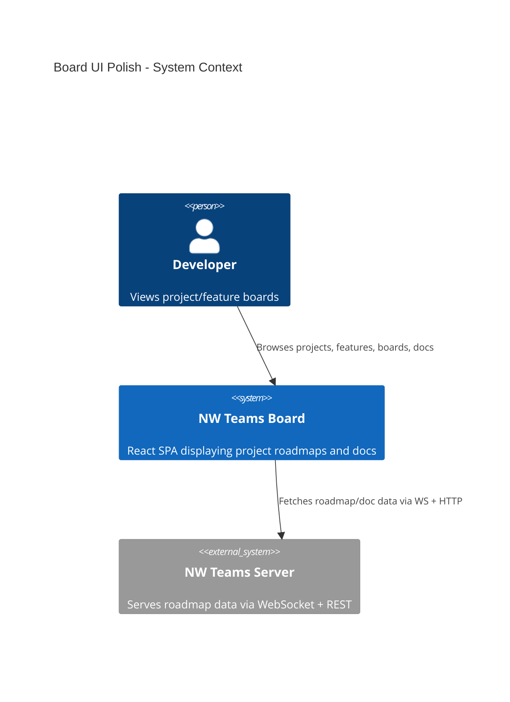
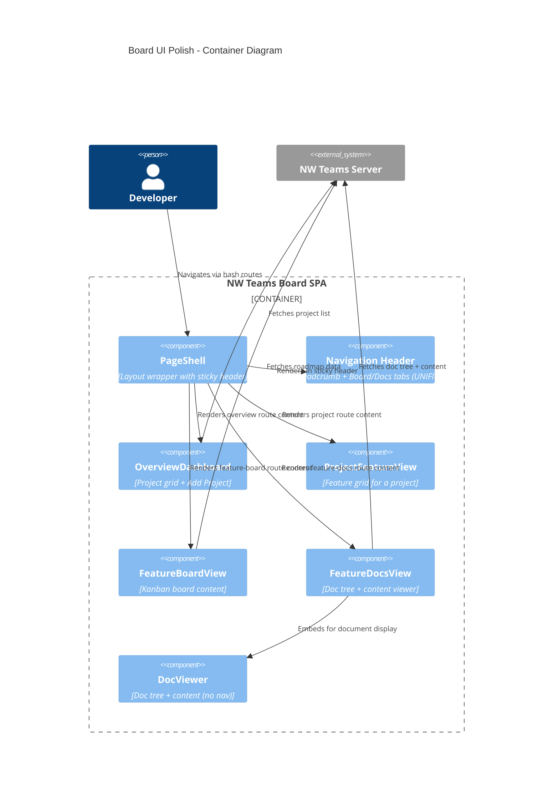
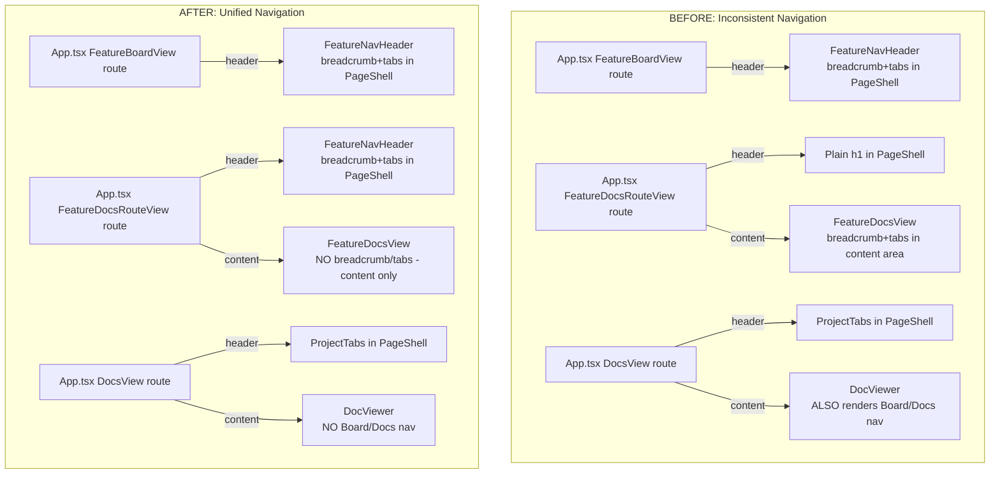

# Board UI Polish -- Architecture Document

## System Context

This feature modifies the existing NW Teams Board frontend application. No new systems, services, or external integrations are introduced. All changes are within the React component layer of the single-page application.

### C4 System Context (L1)

No context-level changes. All modifications are internal to the Board SPA container.

### C4 Container (L2)

### C4 Component (L3) -- Navigation Architecture (Before vs After)

## Component Architecture

### Boundary Changes

#### 1. OverviewDashboard
- **Add Project button**: Left-aligned with "+" icon prefix, no longer `justify-end`
- **AddProjectDialog**: Constrained width (not full-width), rendered inline above grid

#### 2. ProjectCard
- **Density**: Reduced padding and spacing for compact layout
- **Grid**: 4+ columns on large screens instead of 3

#### 3. FeatureCard
- **Remove**: `onBoardClick` and `onDocsClick` props and Board/Docs button row
- **Add**: `onClick` prop -- entire card is clickable
- **Navigation**: Card click navigates to feature board (if hasRoadmap) or feature docs

#### 4. ProjectFeatureView
- **Remove**: `onNavigateFeatureDocs` prop (no longer needed since cards navigate to board)
- **Adapt**: Pass single `onNavigateFeature` to FeatureCard's `onClick`
- **Grid**: 4+ columns on large screens instead of 3

#### 5. Navigation Unification (App.tsx + FeatureDocsView + DocViewer)
- **FeatureDocsRouteView** (App.tsx): Use `FeatureNavHeader` in PageShell header (same as FeatureBoardView route)
- **FeatureDocsView**: Remove breadcrumb and Board/Docs tab nav from content area -- render only ContextDropdowns + DocViewer
- **DocViewer**: Remove `onNavigateToBoard` prop and internal Board/Docs nav -- it is a pure doc display component
- **DocsView** (App.tsx): ProjectTabs already in header -- DocViewer no longer renders duplicate nav

### Props Changes Summary

| Component | Removed Props | Added/Changed Props |
|---|---|---|
| FeatureCard | onBoardClick, onDocsClick | onClick |
| ProjectFeatureView | onNavigateFeatureDocs | onNavigateFeature (single callback) |
| DocViewer | onNavigateToBoard | (removed) |
| FeatureDocsView | onNavigateOverview, onNavigateProject | (removed -- nav moves to PageShell header) |

## Technology Stack

No new dependencies. All changes use existing:
- **React 18** (MIT) -- component restructuring
- **Tailwind CSS v4** (MIT) -- spacing/sizing adjustments
- No new libraries required

## Integration Patterns

No new integration patterns. Existing hash-based routing unchanged. All navigation callbacks remain within the React component tree.

## Quality Attribute Strategies

| Attribute | Strategy |
|---|---|
| Usability | Consistent navigation across all feature routes; fewer clicks to reach feature board |
| Maintainability | Single navigation pattern (breadcrumb+tabs in PageShell header) eliminates 3 different nav implementations |
| Testability | Each component has single responsibility; DocViewer becomes pure display without nav logic |

## Deployment Architecture

No deployment changes. Same Vite SPA build, same server.
