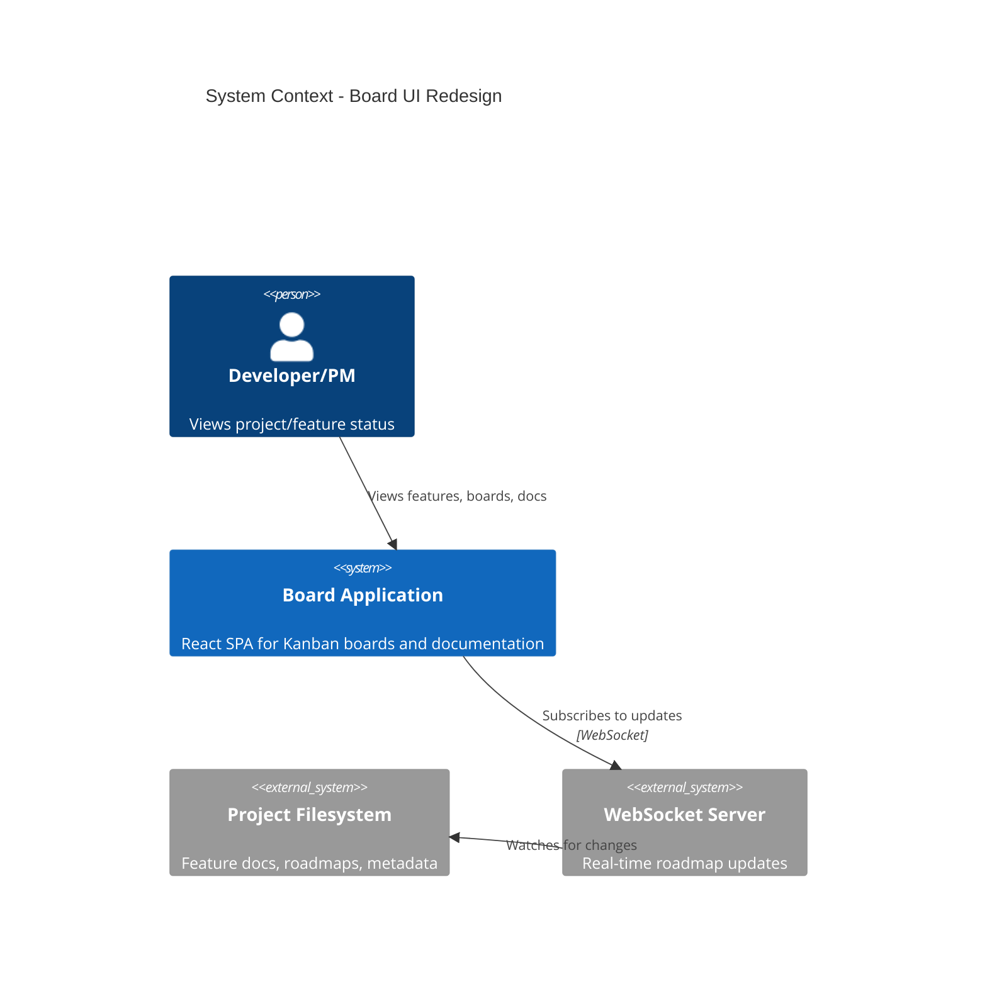
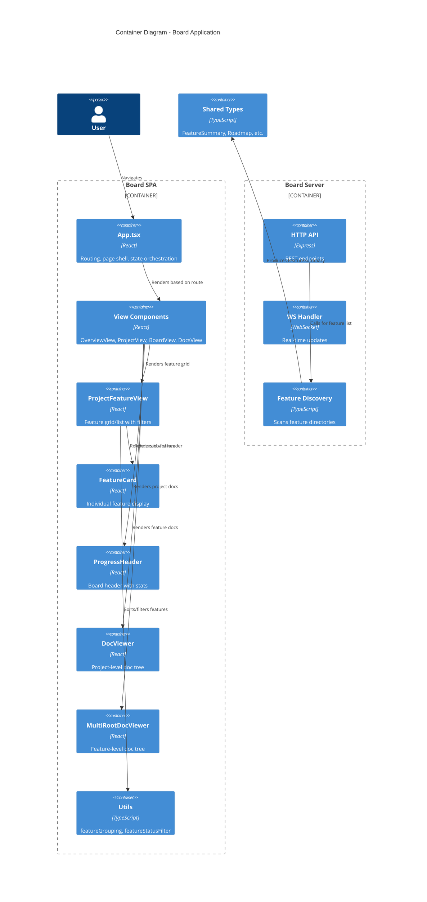
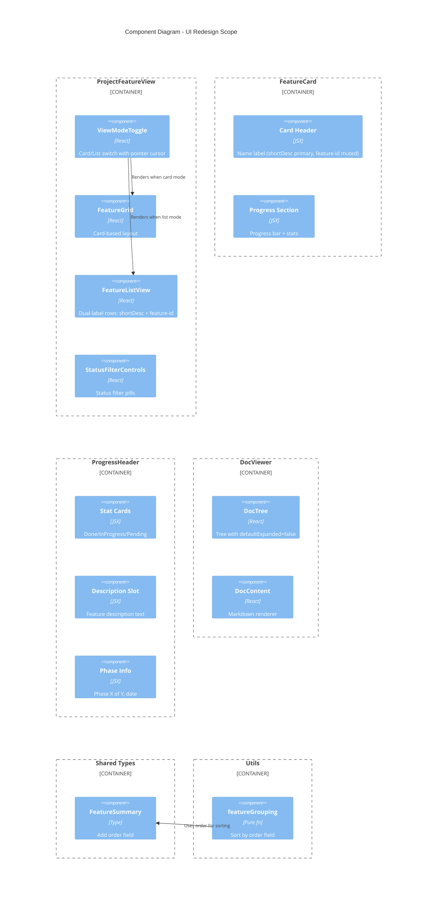

# Architecture Design: board-ui-redesign

## System Context

UI redesign of existing React board application. Eight focused UI changes to existing components, no new services or major architectural shifts.

## Quality Attributes (Priority Order)

1. **Maintainability** - Clean component boundaries, pure functions
2. **Testability** - Each change independently testable
3. **Time-to-market** - Focused UI changes, tight scope

## C4 System Context (L1)

## C4 Container (L2)

## C4 Component (L3) - Affected Components

## Component Boundaries and Responsibilities

### REQ-1: DocViewer defaultExpanded

| Component | Change | Responsibility |
|-----------|--------|----------------|
| `DocViewer.tsx` | Pass `defaultExpanded={false}` to DocTree | Project docs start collapsed |
| `MultiRootDocViewer.tsx` | NO CHANGE | Feature docs remain expanded |
| `DocTree.tsx` | NO CHANGE | Already supports prop |

**Data flow**: DocViewer -> DocTree (prop change only)

### REQ-2: FeatureCard Layout Swap

| Component | Change | Responsibility |
|-----------|--------|----------------|
| `FeatureCard.tsx` | Reorder JSX: description first, feature-id below | Display order |

**Data flow**: No data model change. JSX restructure only.

### REQ-6: Feature Name as Primary Card Label

| Component | Change | Responsibility |
|-----------|--------|----------------|
| `FeatureCard.tsx` | shortDescription as bold primary, feature-id demoted to muted, description removed | Card header redesign |

**Data flow**: No data model change. JSX restructure + style changes. Fallback: feature.name as primary when shortDescription absent.

### REQ-3: List View

| Component | Change | Responsibility |
|-----------|--------|----------------|
| `ProjectFeatureView.tsx` | Add view mode state, render toggle, conditional render | View mode orchestration |
| `FeatureListView.tsx` (NEW) | Compact row layout for features | List rendering |
| `ViewModeToggle.tsx` (NEW) | Card/List switch UI | Toggle control |

**Data flow**: `viewMode` state in ProjectFeatureView drives conditional rendering.

### REQ-7: FeatureListView Short Name + Feature-ID

| Component | Change | Responsibility |
|-----------|--------|----------------|
| `FeatureListView.tsx` | Dual-label display: shortDescription (primary) + feature.name (muted) | Row label redesign |

**Data flow**: No data model change. JSX restructure. Fallback: feature.name only when shortDescription absent.

### REQ-8: ViewModeToggle Pointer Cursor

| Component | Change | Responsibility |
|-----------|--------|----------------|
| `ViewModeToggle.tsx` | Add cursor-pointer class to buttons | UX polish |

**Data flow**: No data change. CSS class addition only.

### REQ-4: Description in ProgressHeader

| Component | Change | Responsibility |
|-----------|--------|----------------|
| `App.tsx (BoardContent)` | Pass description to ProgressHeader, remove standalone p tag | Data passing |
| `ProgressHeader.tsx` | Accept description prop, render between stats and phase info | Display |

**Data flow**: `roadmap.roadmap.description` -> ProgressHeader prop -> render slot.

### REQ-5: Feature Order Metadata

| Component | Change | Responsibility |
|-----------|--------|----------------|
| `board/shared/types.ts` | Add `order?: number` to FeatureSummary | Type definition |
| `board/server/feature-discovery.ts` | Read order from roadmap metadata | Data extraction |
| `board/src/utils/featureGrouping.ts` | Sort by order (nulls last) before name | Sorting logic |

**Data flow**: Roadmap metadata -> FeatureSummary.order -> groupFeaturesByStatus sorting.

## Technology Stack

No new dependencies required. All changes use existing stack:

| Technology | Version | License | Purpose |
|------------|---------|---------|---------|
| React | 19 | MIT | UI framework |
| TypeScript | 5.x | Apache 2.0 | Type safety |
| Tailwind CSS | 4 | MIT | Styling |

## Integration Patterns

### Frontend-Backend

- **FeatureSummary.order**: Backend extracts from `roadmap.roadmap.order` in feature-discovery.ts, frontend receives via existing HTTP/WS APIs
- No new endpoints required

### Component Communication

- **View mode toggle**: Local state in ProjectFeatureView, no prop drilling beyond immediate children
- **Description in header**: Prop passed from BoardContent to ProgressHeader

## Deployment Architecture

No changes. Same React SPA build process, same Express server.

## Quality Attribute Strategies

### Maintainability

- New components (FeatureListView, ViewModeToggle) follow existing pure function + component pattern
- Sorting logic remains in pure function (featureGrouping.ts)

### Testability

- Each REQ independently testable
- REQ-1: Unit test DocViewer renders DocTree with defaultExpanded=false
- REQ-2: Unit test FeatureCard DOM order
- REQ-3: Unit test view mode toggle state, render conditions
- REQ-4: Unit test ProgressHeader accepts/renders description
- REQ-5: Unit test sorting with order field
- REQ-6: Unit test FeatureCard shortDescription as primary, feature-id muted, description absent
- REQ-7: Unit test FeatureListView dual-label display with fallback
- REQ-8: Unit test ViewModeToggle buttons have cursor-pointer

### Time-to-Market

- All changes are additive or simple modifications
- No breaking changes to existing functionality
- Parallel implementation possible (REQs are independent)

## Risks and Mitigations

| Risk | Impact | Mitigation |
|------|--------|------------|
| Order field missing from existing roadmaps | Features without order unsorted | Sort nulls last, fallback to name sort |
| List view performance with many features | Scroll lag | Virtual list if >100 features (defer to crafter) |

## Related ADRs

- ADR-016: View Mode Toggle Pattern
