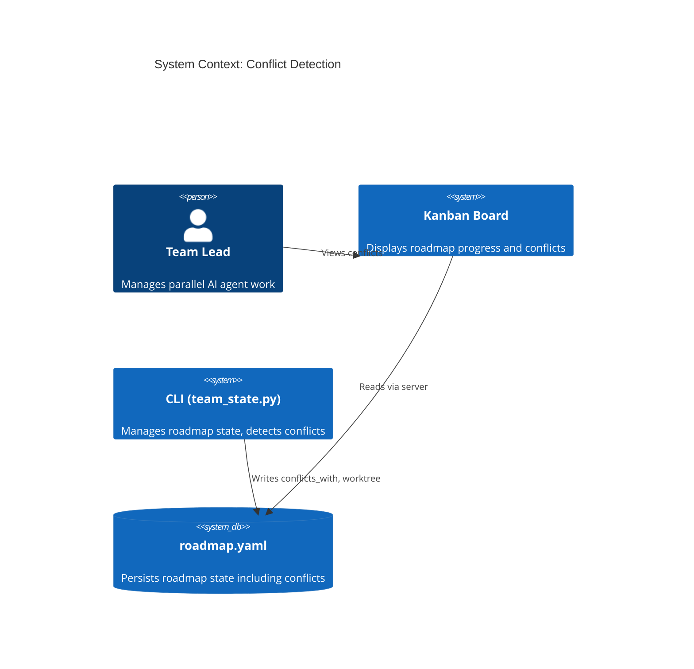
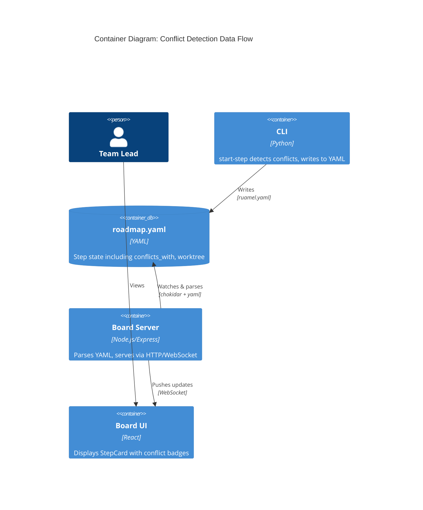
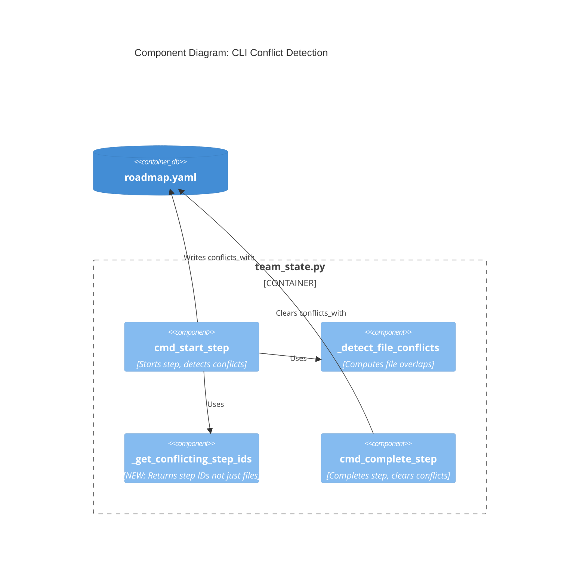
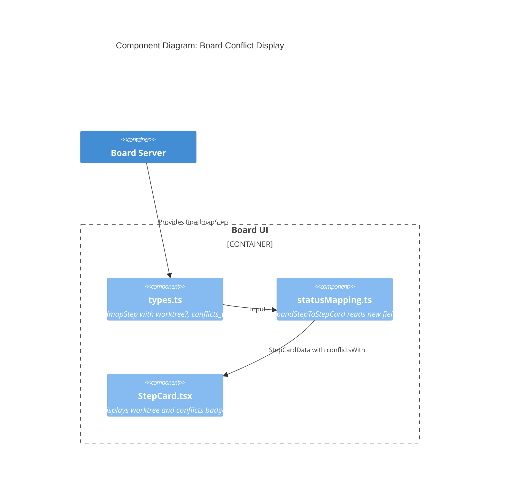

# Architecture Design: Conflict Detection

## Overview

This feature surfaces existing conflict detection data in the kanban board UI. The CLI already computes file conflicts — we extend it to persist conflict metadata, then pass it through to the board for display.

**Architecture Pattern**: Data passthrough (no new computation in board)

## Quality Attributes

| Attribute | Priority | Rationale |
|-----------|----------|-----------|
| Maintainability | High | Single source of truth (CLI computes, board displays) |
| Testability | High | Pure functions, no side effects in display logic |
| Time-to-market | High | Minimal changes — extend existing data flow |

## C4 System Context



## C4 Container



## C4 Component: CLI Changes



## C4 Component: Board Changes



## Data Model Changes

### roadmap.yaml (Step)

```yaml
steps:
  - id: "1.1"
    name: "Implement auth"
    files_to_modify: ["src/auth.ts"]
    status: in_progress
    # NEW FIELDS:
    worktree: "/path/to/.claude/worktrees/crafter-1.1"  # Set by start-step if conflicts
    conflicts_with: ["2.1", "3.1"]                       # NEW: Step IDs sharing files
```

### TypeScript Types

```typescript
// board/shared/types.ts - RoadmapStep additions
export interface RoadmapStep {
  // ... existing fields ...
  readonly worktree?: string;              // NEW: Path if using worktree
  readonly conflicts_with?: readonly string[];  // NEW: Conflicting step IDs
}

// board/src/utils/statusMapping.ts - StepCardData additions
export interface StepCardData {
  // ... existing fields ...
  readonly conflictsWith: readonly string[];  // NEW: For display
}
```

## Integration Points

| Component | File | Change |
|-----------|------|--------|
| CLI | `src/agent_ensemble/cli/team_state.py` | Add `_get_conflicting_step_ids()`, write `conflicts_with` in `cmd_start_step` |
| Types | `board/shared/types.ts` | Add `worktree?`, `conflicts_with?` to `RoadmapStep` |
| Mapping | `board/src/utils/statusMapping.ts` | Read `worktree` (truthy), add `conflictsWith` to `StepCardData` |
| Display | `board/src/components/StepCard.tsx` | Add conflicts badge, tooltip |

## Decision: No Client-Side Computation

The CLI already has `_detect_file_conflicts()`. Rather than duplicate this logic in TypeScript:

1. CLI writes `conflicts_with: [step-ids]` to roadmap.yaml
2. Board reads and displays

**Benefits**:
- Single source of truth
- No sync issues between CLI and board logic
- Simpler board code (just display)

## Mutual Update Strategy

When step A starts and conflicts with active step B:
1. Write `conflicts_with: [B]` to step A
2. Update step B's `conflicts_with` to include A

When step A completes:
1. Clear `conflicts_with` from step A
2. Remove A from all other steps' `conflicts_with` arrays

This ensures the board always shows current conflict state.
