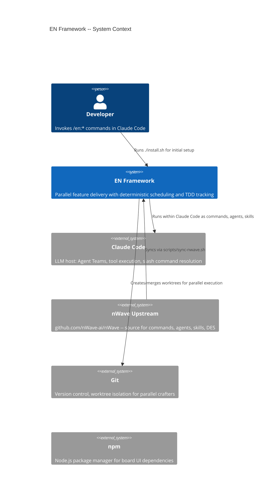
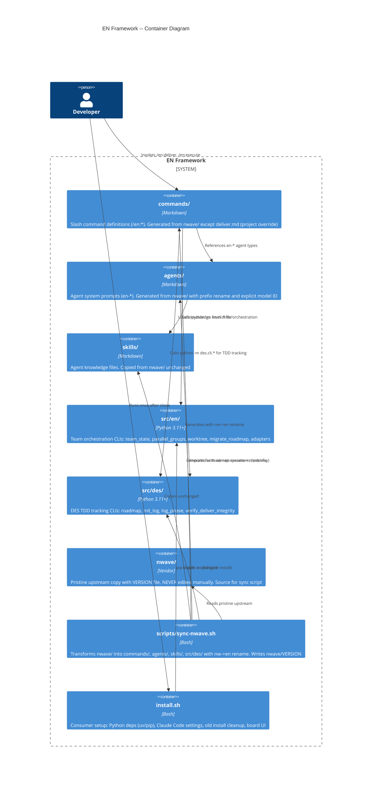
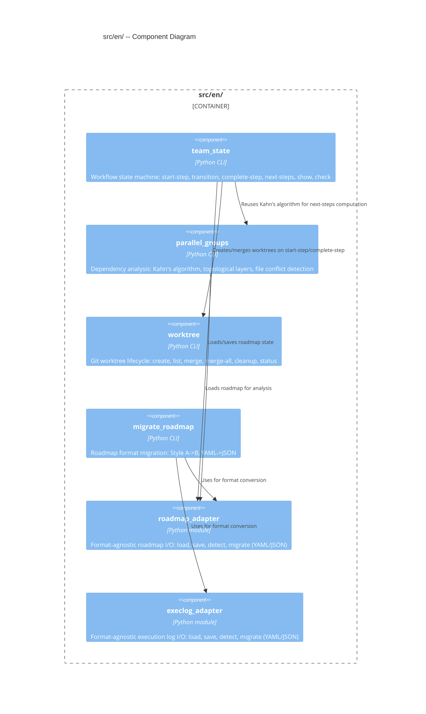
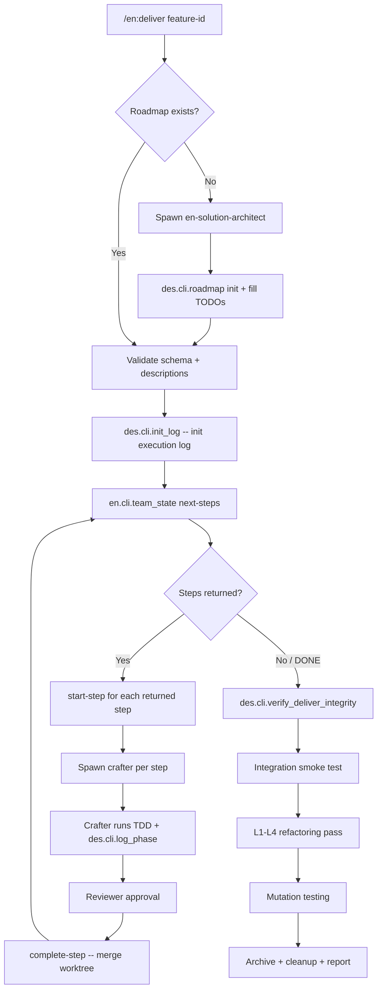

# EN Consolidation -- Architecture Design

## System Context

The EN framework consolidates two previously separate systems -- nWave (global plugin) and Agent Ensemble (project-local) -- into a single self-contained project. The system enables parallel feature delivery using Claude Code Agent Teams with deterministic scheduling and TDD compliance tracking.

### Actors and External Systems

- **Developer**: Invokes `/en:*` slash commands in Claude Code
- **Claude Code**: Host environment providing Agent Teams, tool execution, slash command resolution
- **nWave Upstream**: Source repository at github.com/nWave-ai/nWave for periodic sync
- **Git**: Worktree management for parallel crafter isolation

## C4 System Context (L1)



## C4 Container (L2)



## C4 Component (L3) -- src/en/ Package

The `src/en/` package has 6 modules with clear responsibilities. This warrants L3 detail.



## Data Flow: en:deliver Execution



## Dependency Direction

```
commands/ --> agents/ --> skills/
    |             |
    v             v
src/en/  ------> src/des/
(imports)    (NEVER imports en/)
```

`en/` depends on `des/` (for roadmap schema types). `des/` NEVER imports `en/`. This ensures the DES fork remains sync-able with upstream without entangling project-specific orchestration logic.

## Sync Architecture

```
nwave/                          (pristine upstream, git-tracked, includes VERSION)
    |
    | scripts/sync-nwave.sh
    |   Version tracking:
    |     Writes nwave/VERSION (tag, commit SHA, sync timestamp)
    |   Content transforms:
    |     /nw: --> /en:
    |     nw- --> en- (agent names)
    |     ~/.claude/skills/nw/ --> skills/
    |     ~/.claude/commands/nw/ --> commands/
    |     $HOME/.claude/lib/python --> src
    |     model: inherit --> model: claude-opus-4-6
    |   File renames:
    |     nw-*.md --> en-*.md (agents only)
    |   Override protection:
    |     commands/deliver.md NEVER overwritten
    |
    +--> commands/    (generated)
    +--> agents/      (generated, renamed)
    +--> skills/      (copied)
    +--> src/des/     (copied)
    +--> nwave/VERSION (tag + commit SHA + timestamp)

install.sh                      (consumer setup, run once after clone)
    |
    | Steps:
    |   1. Clean up old ~/.claude/ installations
    |   2. uv pip install -e . (or pip fallback) -- Python deps + editable install
    |   3. Auto-configure CLAUDE_CODE_EXPERIMENTAL_AGENT_TEAMS in ~/.claude/settings.json
    |   4. npm install in board/ -- dashboard UI
    |   5. Print summary of available /en:* commands
```

## Requirements Traceability

| User Story | Component(s) | ADR |
|---|---|---|
| US-01: Populate nwave/ | nwave/ (vendor directory) | ADR-017 |
| US-02: Rename package | src/en/ (from agent_ensemble) | ADR-018 |
| US-03: Generate commands/ | commands/, scripts/sync-nwave.sh | ADR-017, ADR-018 |
| US-03b: Generate agents/ | agents/, scripts/sync-nwave.sh | ADR-017, ADR-018 |
| US-03c: Generate skills/ | skills/, scripts/sync-nwave.sh | ADR-017 |
| US-04: Delete old commands | commands/ (cleanup) | -- |
| US-05: Rewrite en:deliver | commands/deliver.md (override) | ADR-019 |
| US-05b: Add next-steps CLI | src/en/cli/team_state.py | ADR-019 |
| US-06: Update PYTHONPATH | commands/, agents/ (content transforms) | ADR-017 |
| US-07: Sync script | scripts/sync-nwave.sh, nwave/VERSION | ADR-017 |
| US-08: Install script | install.sh, ~/.claude/settings.json | -- |

## Quality Attribute Strategies

| Quality Attribute | Strategy |
|---|---|
| **Maintainability** | Vendor sync from upstream via `nwave/` + idempotent sync script. Single package rename (`en/`). Clear dependency direction. |
| **Testability** | Pure functions for scheduling (Kahn's algorithm). Adapters isolate I/O. FP paradigm: pure core, effect shell. |
| **Time-to-market** | Reuse existing CLIs (team_state, parallel_groups, worktree). `next-steps` extends team_state, does not replace it. |
| **Reliability** | Deterministic scheduling via algorithm, not LLM judgment. Worktree isolation prevents file conflicts. Atomic CLI commands (start-step, complete-step). |
| **Operability** | Single `sync-nwave.sh` command for upstream updates. `--dry-run` support. Change reporting. Version tracking via `nwave/VERSION`. |
| **Onboarding** | Single `./install.sh` command for consumer setup. Idempotent. Auto-configures Claude Code settings. Cleans up old installations. |
