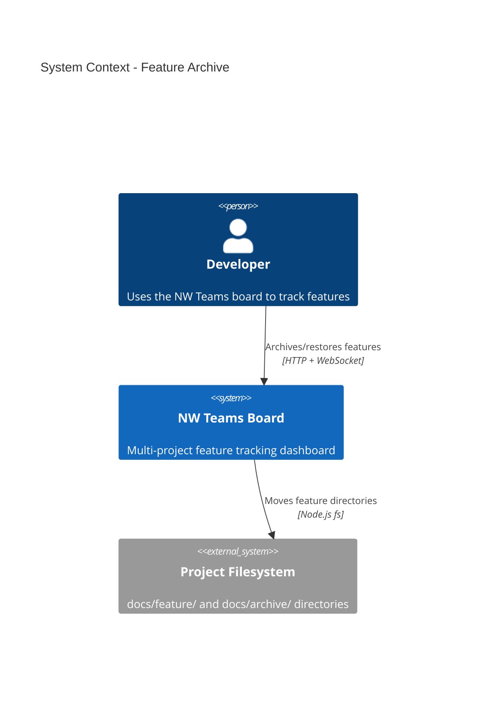
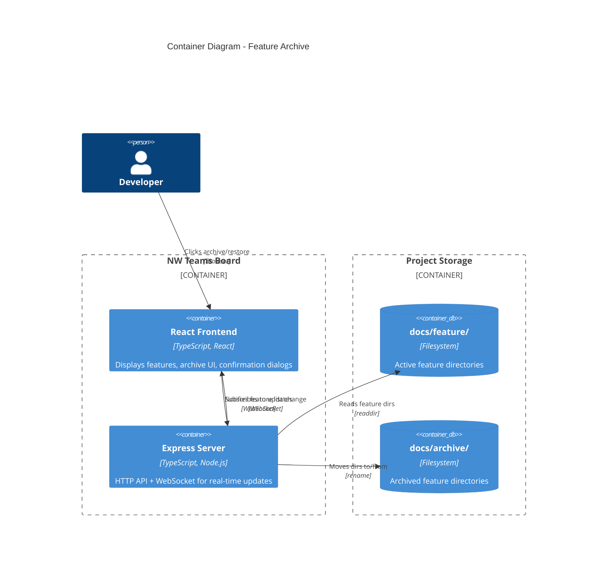
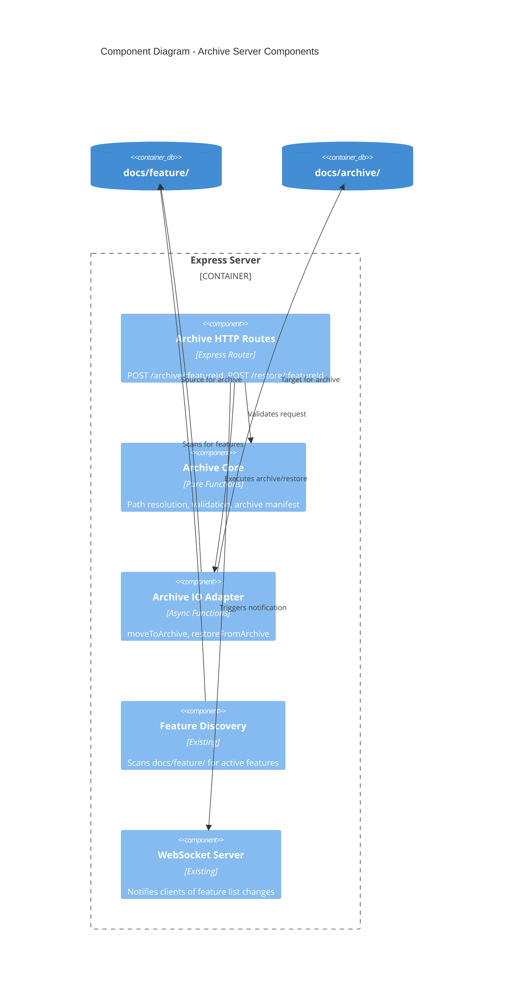

# Feature Archive - Architecture Design

## Overview

The Feature Archive capability allows users to archive completed or abandoned features from a project. Archived features are moved to a dedicated directory within the project, removing them from active display while preserving all documentation for future reference or restoration.

## Quality Attribute Priorities

1. **Speed/Simplicity** - Single confirmation, minimal steps
2. **Data Safety** - Server-side atomic operations with rollback on failure
3. **Restorability** - Full restore capability from UI

## Architectural Approach

Following the existing codebase patterns:
- **Pure Core + IO Adapters** (functional paradigm)
- **Server-side operations** - Browser sends requests, server handles filesystem
- **WebSocket notifications** - Real-time UI updates after archive/restore

---

## C4 System Context Diagram



---

## C4 Container Diagram



---

## C4 Component Diagram - Server



---

## Component Boundaries

### Pure Core (No Side Effects)

| Component | Responsibility | Location |
|-----------|---------------|----------|
| `resolveArchivePath` | `(projectPath, featureId) → archivePath` | `board/server/archive-path-resolver.ts` |
| `validateArchiveRequest` | Validates featureId exists in active features | `board/server/archive-core.ts` |
| `validateRestoreRequest` | Validates featureId exists in archive | `board/server/archive-core.ts` |
| `deriveArchivedFeatures` | Scans archive dir → `ArchivedFeature[]` | `board/server/archive-core.ts` |

### IO Adapters (Side Effects)

| Component | Responsibility | Location |
|-----------|---------------|----------|
| `moveToArchiveFs` | Atomic directory move: `docs/feature/{id}` → `docs/archive/{id}` | `board/server/archive-io.ts` |
| `restoreFromArchiveFs` | Atomic directory move: `docs/archive/{id}` → `docs/feature/{id}` | `board/server/archive-io.ts` |
| `scanArchiveDirFs` | List archived feature directories | `board/server/archive-io.ts` |

### HTTP Routes

| Endpoint | Method | Action |
|----------|--------|--------|
| `/api/projects/:id/features/:featureId/archive` | POST | Archive a feature |
| `/api/projects/:id/archive` | GET | List archived features |
| `/api/projects/:id/archive/:featureId/restore` | POST | Restore an archived feature |

### Frontend Components

| Component | Responsibility | Location |
|-----------|---------------|----------|
| `useArchiveFeature` | Hook for archive operation with confirmation | `board/src/hooks/useArchiveFeature.ts` |
| `useRestoreFeature` | Hook for restore operation | `board/src/hooks/useRestoreFeature.ts` |
| `useArchivedFeatures` | Hook to fetch archived feature list | `board/src/hooks/useArchivedFeatures.ts` |
| `ArchiveConfirmDialog` | Confirmation modal before archive | `board/src/components/ArchiveConfirmDialog.tsx` |
| `ArchivedFeaturesSection` | Collapsible section showing archived features | `board/src/components/ArchivedFeaturesSection.tsx` |

---

## Data Flow

### Archive Flow

```
User clicks "Archive" on feature card
    ↓
ArchiveConfirmDialog shown ("Archive feature-name?")
    ↓
User confirms
    ↓
POST /api/projects/{projectId}/features/{featureId}/archive
    ↓
Server: validateArchiveRequest (pure)
    ↓
Server: moveToArchiveFs (IO) — atomic rename
    ↓
Server: notifyProjectListChange (WebSocket)
    ↓
Frontend: feature disappears from active list
Frontend: feature appears in archived section
```

### Restore Flow

```
User clicks "Restore" on archived feature
    ↓
POST /api/projects/{projectId}/archive/{featureId}/restore
    ↓
Server: validateRestoreRequest (pure)
    ↓
Server: restoreFromArchiveFs (IO) — atomic rename
    ↓
Server: notifyProjectListChange (WebSocket)
    ↓
Frontend: feature disappears from archived section
Frontend: feature appears in active list
```

---

## Directory Structure

```
project-root/
├── docs/
│   ├── feature/           # Active features (existing)
│   │   ├── auth-system/
│   │   └── user-profile/
│   └── archive/           # NEW: Archived features
│       ├── old-feature/
│       └── abandoned-poc/
```

---

## Types

```typescript
// New types in shared/types.ts

export interface ArchivedFeature {
  readonly featureId: FeatureId;
  readonly name: string;
  readonly archivedAt: string;  // ISO timestamp from filesystem mtime
}

export type ArchiveError =
  | { readonly type: 'not_found'; readonly featureId: FeatureId }
  | { readonly type: 'already_archived'; readonly featureId: FeatureId }
  | { readonly type: 'move_failed'; readonly message: string };

export type RestoreError =
  | { readonly type: 'not_found'; readonly featureId: FeatureId }
  | { readonly type: 'already_exists'; readonly featureId: FeatureId }
  | { readonly type: 'move_failed'; readonly message: string };
```

---

## Error Handling

| Scenario | Behavior |
|----------|----------|
| Feature not found | 404 with `{error: "Feature not found"}` |
| Feature already archived | 409 with `{error: "Feature already archived"}` |
| Archive dir doesn't exist | Server creates `docs/archive/` on first archive |
| Move fails (permissions) | 500 with `{error: "Failed to archive: [reason]"}` |
| Restore target exists | 409 with `{error: "Feature already exists in active features"}` |

---

## WebSocket Protocol Extension

No new message types needed. Existing `project_list` notification already handles feature list changes:

```typescript
// Existing - reused for archive/restore
{ type: 'project_list', projects: ProjectSummary[] }
```

The `features` array in `ProjectSummary` will automatically exclude archived features (since they're moved out of `docs/feature/`).

---

## UI Mockups

### Feature Card with Archive Button

```
┌─────────────────────────────────────┐
│ auth-system                    ⋮    │
│ 8/10 steps • 80%                    │
│ ████████░░                          │
│ 2 active                            │
│ Updated 03/04/2026            [Archive] │
└─────────────────────────────────────┘
```

### Confirmation Dialog

```
┌────────────────────────────────────────┐
│         Archive Feature?               │
│                                        │
│  Are you sure you want to archive      │
│  "auth-system"?                        │
│                                        │
│  The feature will be moved to the      │
│  archive and can be restored later.    │
│                                        │
│        [Cancel]    [Archive]           │
└────────────────────────────────────────┘
```

### Archived Features Section (Collapsed by default)

```
┌─────────────────────────────────────┐
│ ▶ Archived (2)                      │
└─────────────────────────────────────┘

Expanded:
┌─────────────────────────────────────┐
│ ▼ Archived (2)                      │
├─────────────────────────────────────┤
│ old-feature         [Restore]       │
│ Archived Mar 1, 2026                │
├─────────────────────────────────────┤
│ abandoned-poc       [Restore]       │
│ Archived Feb 28, 2026               │
└─────────────────────────────────────┘
```

---

## Implementation Phases

### Phase 1: Core Archive Infrastructure
- Add `ArchivedFeature` type to `shared/types.ts`
- Create `archive-path-resolver.ts` (pure)
- Create `archive-io.ts` (IO adapter)

### Phase 2: Server HTTP Routes
- Add archive endpoint to `index.ts`
- Add restore endpoint to `index.ts`
- Add list archived endpoint to `index.ts`

### Phase 3: Frontend Hooks
- Create `useArchiveFeature.ts`
- Create `useRestoreFeature.ts`
- Create `useArchivedFeatures.ts`

### Phase 4: UI Components
- Create `ArchiveConfirmDialog.tsx`
- Create `ArchivedFeaturesSection.tsx`
- Add archive button to `FeatureCard.tsx`

### Phase 5: Integration
- Wire up WebSocket notifications
- Add archived section to `ProjectFeatureView.tsx`
- E2E testing

---

## Alternatives Considered

### 1. Soft Delete (flag in manifest)
- **Rejected**: Would require manifest changes and keep files in place
- Current approach is simpler and matches "archive = move" mental model

### 2. Zip Archive
- **Rejected**: Adds compression complexity, harder to browse/restore
- Simple directory move is atomic and inspectable

### 3. External Archive Location
- **Rejected**: Breaks project locality, harder for git tracking
- In-project archive keeps everything together
