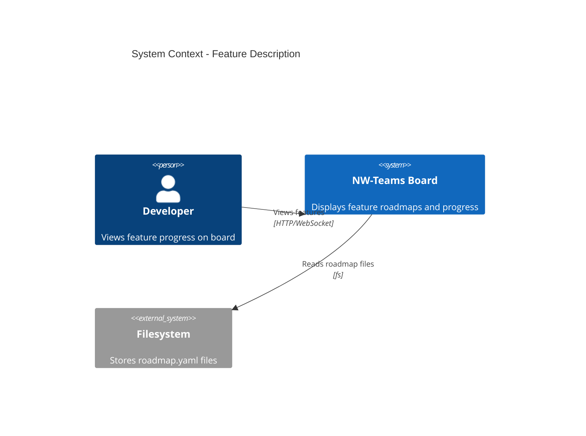
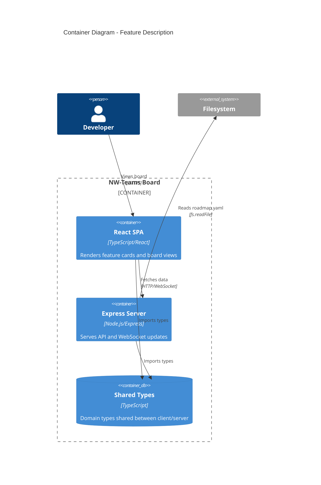
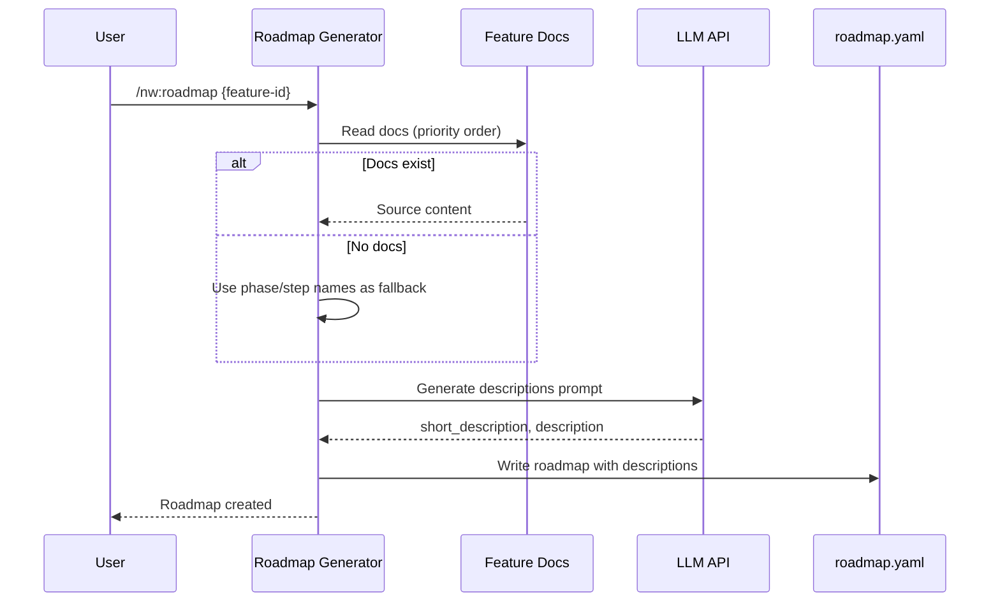

# Feature Description - Architecture Design

## Overview

Add AI-generated description metadata to features for display in the board UI:
- **Short description** (max 100 words): Displayed on FeatureCard
- **Detailed description** (max 200 words): Displayed at top of FeatureBoardView

Descriptions are **AI-generated** from nwave-generated docs during roadmap creation, not manually authored.

## System Context (C4 Level 1)



## Container Diagram (C4 Level 2)



## Description Generation Workflow

### Generation Trigger

**Option A (Recommended): During roadmap creation**

Descriptions are generated when `/nw:roadmap` creates or updates a roadmap. The roadmap generator reads feature docs, generates descriptions via LLM, and writes them to `roadmap.yaml` in a single pass.

**Why Option A**:
- Single point of generation (simplest)
- No lazy-loading complexity
- Descriptions available immediately when roadmap exists
- Aligns with existing workflow (roadmap creation is already an LLM-assisted step)

**Rejected alternatives**:
- Option B (on-demand command): Adds maintenance burden, easy to forget
- Option C (lazy on first board view): Adds server-side LLM dependency, latency on first view

### Source Priority

The generator reads docs in this priority order (first available wins):

| Priority | Source Path | Content Used |
|----------|-------------|--------------|
| 1 | `docs/feature/{name}/design/architecture.md` | Overview section |
| 2 | `docs/feature/{name}/requirements/requirements.md` | Feature Overview section |
| 3 | `docs/feature/{name}/discuss/requirements.md` | Full document |
| 4 | `docs/feature/{name}/discuss/user-stories.md` | Story summaries |
| 5 | `docs/feature/{name}/discuss/jtbd-job-stories.md` | Job story summaries |
| 6 | (fallback) Phase and step names from roadmap | Concatenated names |

### Generation Prompt Template

```
Generate two descriptions for a software feature based on the documentation below.

1. SHORT_DESCRIPTION (max 100 words): A concise summary suitable for a card UI. Focus on WHAT the feature does and its primary benefit. Use present tense, active voice.

2. DESCRIPTION (max 200 words): A detailed summary for a feature header. Include the problem being solved, key capabilities, and scope boundaries. Use present tense, active voice.

Documentation:
---
{source_content}
---

Output format (YAML):
short_description: "..."
description: "..."
```

### Fallback Behavior

When no docs exist, generate from phase/step names:

```
Generate descriptions from this roadmap structure:

Phases:
- Phase 1: {phase_name}
  - Step 1-1: {step_name}
  - Step 1-2: {step_name}
- Phase 2: {phase_name}
  ...
```

## Component Boundaries

### Affected Components

| Component | Location | Change Type | Responsibility |
|-----------|----------|-------------|----------------|
| **Generation (new)** |||
| Description generator | Roadmap generator (solution-architect) | New | Generate descriptions from docs |
| **Storage** |||
| RoadmapMeta type | `board/shared/types.ts` | Extend | Add description fields to type |
| **Parsing** |||
| validateRoadmapMeta | `board/server/parser.ts` | Extend | Extract description fields from YAML |
| **Discovery** |||
| deriveFeatureSummary | `board/server/feature-discovery.ts` | Extend | Pass descriptions to FeatureSummary |
| FeatureSummary type | `board/shared/types.ts` | Extend | Add description fields to type |
| **Display** |||
| FeatureCard | `board/src/components/FeatureCard.tsx` | Extend | Display short description |
| FeatureBoardView | `board/src/components/FeatureBoardView.tsx` | Extend | Display detailed description |

### Data Flow

```
Feature Docs (source material)
    |
    v
Roadmap Generator (LLM) -- generates short_description, description
    |
    v
roadmap.yaml (persisted)
    |
    v
parser.ts::validateRoadmapMeta() -- extracts description fields
    |
    v
RoadmapMeta type -- carries description fields
    |
    v
feature-discovery.ts::deriveFeatureSummary() -- maps to FeatureSummary
    |
    v
FeatureSummary type -- carries description fields to UI
    |
    +---> FeatureCard (displays shortDescription)
    |
    +---> FeatureBoardView (displays description)
```

### Generation Sequence



## Data Model Changes

### roadmap.yaml Schema Extension

```yaml
roadmap:
  project_id: example-feature
  created_at: '2026-03-04T10:00:00Z'
  short_description: "Brief summary for card display (max 100 words)"  # NEW
  description: "Detailed description for board header (max 200 words)"  # NEW
  total_steps: 3
  phases: 1
phases:
  - id: '01'
    name: 'Implementation'
    steps: [...]
```

### RoadmapMeta Type Extension

```typescript
interface RoadmapMeta {
  readonly project_id?: string;
  readonly created_at?: string;
  readonly short_description?: string;  // NEW - max 100 words
  readonly description?: string;         // NEW - max 200 words
  readonly total_steps?: number;
  readonly phases?: number;
  readonly status?: string;
  readonly reviewer?: string;
  readonly approved_at?: string;
}
```

### FeatureSummary Type Extension

```typescript
interface FeatureSummary {
  readonly featureId: FeatureId;
  readonly name: string;
  readonly shortDescription?: string;  // NEW - from roadmap.short_description
  readonly description?: string;        // NEW - from roadmap.description
  readonly hasRoadmap: boolean;
  readonly hasExecutionLog: boolean;
  readonly totalSteps: number;
  readonly done: number;
  readonly inProgress: number;
  readonly currentLayer: number;
  readonly updatedAt: string;
}
```

## UI Behavior

### FeatureCard
- Display `shortDescription` below feature name
- Truncate with ellipsis if text overflows available space
- Show nothing if `shortDescription` is undefined (current behavior preserved)

### FeatureBoardView
- Display `description` above KanbanBoard, below ContextDropdowns
- Static display (no collapse/expand)
- Show nothing if `description` is undefined (current behavior preserved)

## Technology Stack

| Component | Technology | License | Rationale |
|-----------|------------|---------|-----------|
| Parser | js-yaml (existing) | MIT | Already in use, no change needed |
| Types | TypeScript (existing) | Apache-2.0 | Already in use |
| UI | React (existing) | MIT | Already in use |

No new dependencies required.

## Quality Attributes

### Maintainability
- Follows existing FP patterns (pure functions, immutable types)
- Extends existing types rather than creating new ones
- Single source of truth (roadmap.yaml)

### Simplicity
- No new file types or discovery logic
- Reuses existing parser infrastructure
- Minimal component changes

### Backward Compatibility
- All new fields are optional
- Existing roadmap.yaml files work without modification
- UI gracefully handles missing descriptions

## Rejected Alternatives

See ADR-014 for detailed analysis of rejected alternatives:
1. Separate meta.yaml file
2. README.md parsing
3. Manual authoring (replaced by AI generation)
4. On-demand generation command
5. Lazy server-side generation

## Development Paradigm

**Functional Programming** (per project CLAUDE.md)

Implications for implementation:
- Pure transformation functions for description extraction
- Immutable types with readonly modifiers
- Effect boundaries at IO adapters only
- No class-based components

## Handoff to Acceptance Designer

This architecture is ready for acceptance test design. Key scenarios:

### Generation Scenarios
1. Roadmap created with architecture.md generates descriptions from architecture
2. Roadmap created with requirements.md (no architecture) generates from requirements
3. Roadmap created with no docs generates from phase/step names
4. Generated short_description respects 100-word limit
5. Generated description respects 200-word limit

### Display Scenarios
6. Feature with both descriptions displays correctly in card and board
7. Feature with only short description displays partial
8. Feature with no descriptions displays current behavior
9. Short description truncation with ellipsis on overflow

### Backward Compatibility
10. Existing roadmap.yaml files without descriptions continue working
