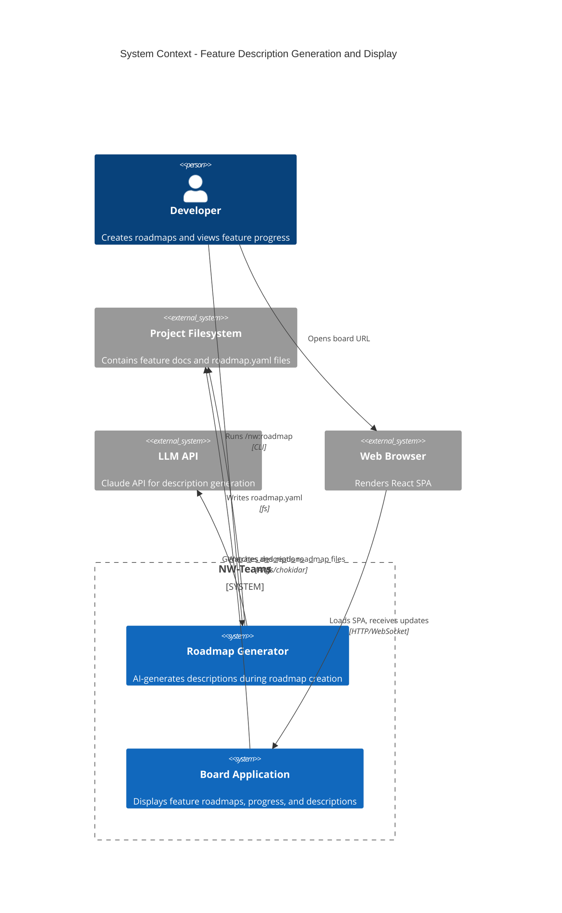
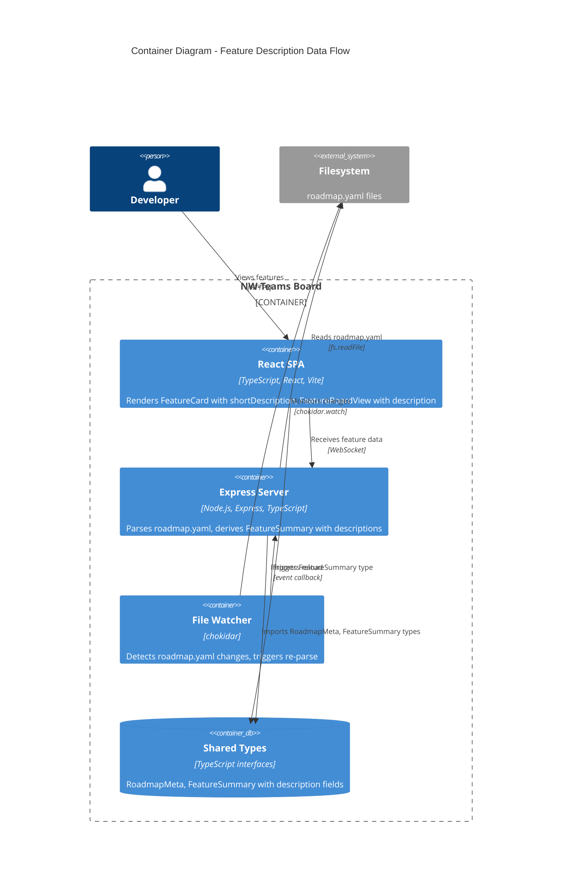
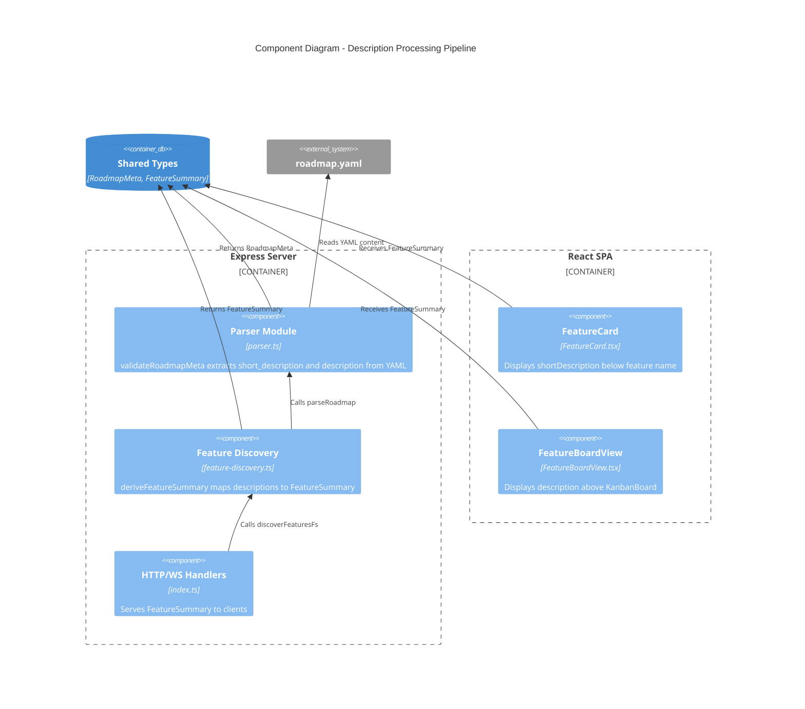
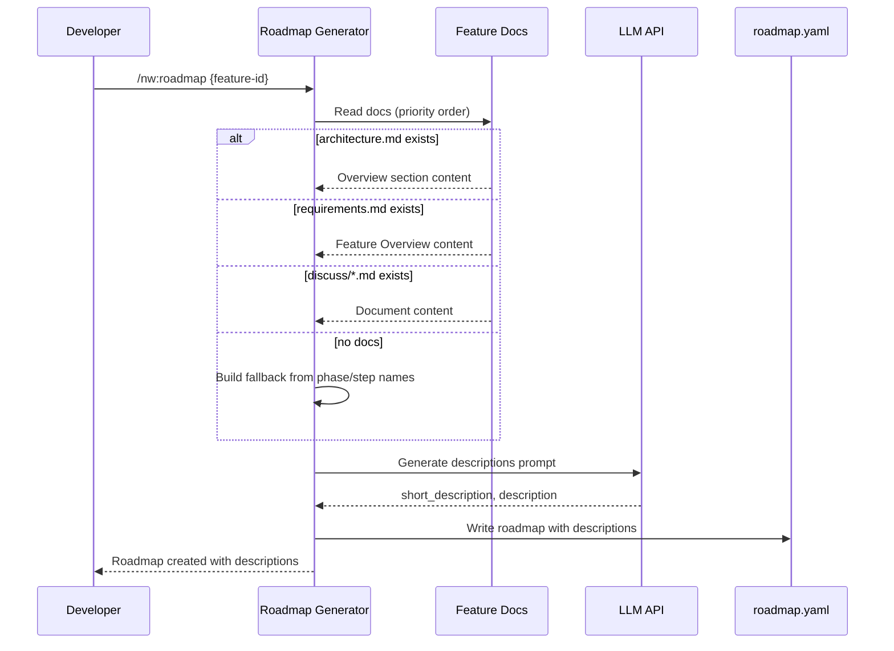
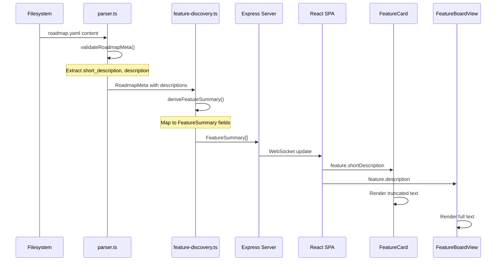

# Feature Description - C4 Diagrams

## System Context (Level 1)

Shows the complete system including generation and display workflows.

## Container Diagram (Level 2)

Shows the internal containers of the board application.

## Component Diagram (Level 3)

Shows internal components within the server container for description handling.

## Sequence: Description Generation Flow

## Sequence: Description Display Flow

