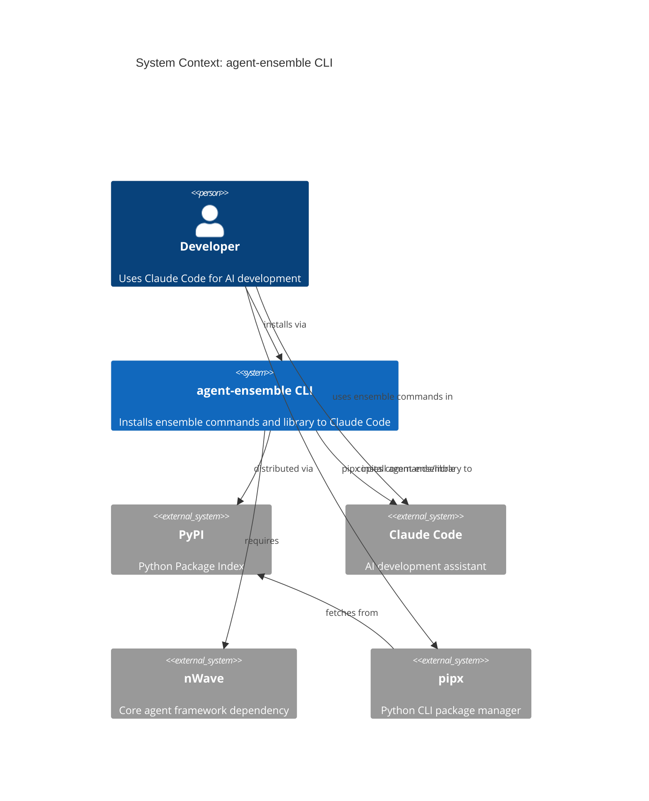
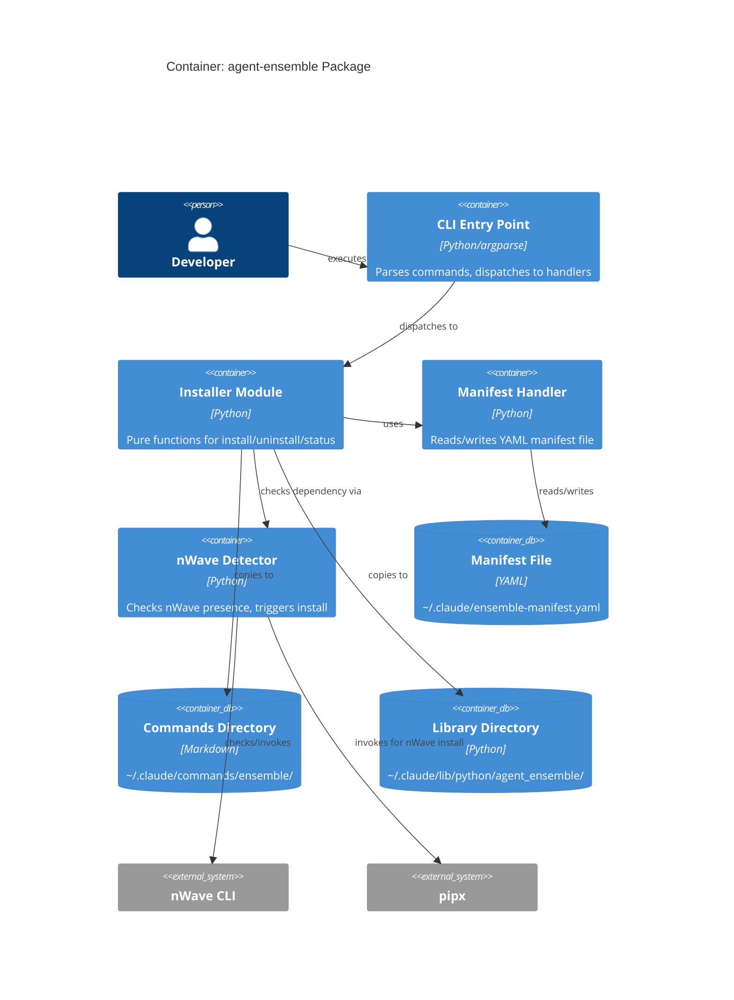

# Packaging Feature - Architecture Design

**Status**: DESIGN Complete
**Date**: 2026-03-04
**Author**: Morgan (Solution Architect)

## Executive Summary

Design for PyPI-distributable CLI packaging of agent-ensemble. Simple functional architecture: pure functions for operations, effects at edges, single entry point CLI.

## C4 System Context (L1)



## C4 Container (L2)



## Architecture Approach

### Quality Attributes Driving Decisions

| Attribute | Priority | Implication |
|-----------|----------|-------------|
| Time-to-market | 1 | Minimal architecture, stdlib where possible |
| Maintainability | 2 | Clear separation, pure functions, no hidden state |
| Reliability | 3 | Idempotent operations, backup before destructive actions |
| Testability | 4 | Pure core, effects at edges |

### Pattern Selection: Functional Core, Imperative Shell

Given the functional paradigm requirement (CLAUDE.md), architecture uses:
- **Pure functions** for logic: manifest parsing, file list building, health checking
- **Effect functions** at edges: filesystem I/O, subprocess calls, user prompts
- **Composition** over inheritance: pipeline of transformations
- **Result types** for error handling: explicit success/failure values

This is simpler than full ports-and-adapters for a CLI tool of this size. No interfaces needed; dependency injection via function parameters when testing.

### Rejected Alternatives

1. **Click/Typer framework**: Adds dependency, argparse sufficient for 4 commands
2. **Full hexagonal architecture**: Over-engineering for ~500 LOC CLI tool
3. **Class-based OOP design**: Functional paradigm specified in CLAUDE.md

## Component Architecture

### Module Structure

```
src/agent_ensemble/
  __init__.py          # Version constant
  cli/__init__.py      # Existing CLI tools (team_state, etc.)
  packaging/
    __init__.py        # Package exports
    main.py            # CLI entry point, argparse setup
    installer.py       # install/uninstall pure functions
    manifest.py        # Manifest read/write
    detector.py        # nWave detection
    types.py           # Data classes (InstallResult, StatusReport, etc.)
    constants.py       # Paths, version
```

### Data Flow (Functional Pipeline)

```
Install Command:
  parse_args()
    -> detect_nwave()
    -> ensure_nwave_installed()
    -> check_existing_installation()
    -> create_backup_if_needed()
    -> copy_files()
    -> write_manifest()
    -> format_success_message()

Uninstall Command:
  parse_args()
    -> read_manifest()
    -> prompt_confirmation()
    -> remove_files()
    -> remove_manifest()
    -> format_success_message()

Status Command:
  parse_args()
    -> read_manifest()
    -> check_file_health()
    -> format_status_report()
```

### Component Responsibilities

| Component | Responsibility | Pure/Effect |
|-----------|---------------|-------------|
| main.py | CLI parsing, dispatch, exit codes | Effect (I/O) |
| installer.py | File operations logic, backup creation | Effect (filesystem) |
| manifest.py | YAML serialization/deserialization | Pure (parsing) + Effect (I/O) |
| detector.py | nWave presence check, install invocation | Effect (subprocess) |
| types.py | Data structures, no behavior | Pure (data) |
| constants.py | Configuration values | Pure (values) |

## Technology Stack

| Component | Technology | Rationale |
|-----------|------------|-----------|
| CLI Framework | argparse (stdlib) | No dependencies, sufficient for 4 commands |
| Manifest Format | YAML | Aligned with nWave, human-readable, pyyaml already dependency |
| Package Build | setuptools | Already configured in pyproject.toml |
| Filesystem Ops | pathlib (stdlib) | Type-safe path handling |
| Subprocess | subprocess (stdlib) | nWave detection and installation |

See `technology-stack.md` for detailed decisions.

## Integration Patterns

### nWave Dependency

```
Detection Strategy:
1. Check `which nwave-ai` command exists
2. OR check ~/.claude/commands/nw/ directory exists
3. If missing: invoke `pipx install nwave-ai && nwave-ai install`
4. On failure: show manual installation instructions, abort
```

### Manifest File Contract

```yaml
# ~/.claude/ensemble-manifest.yaml
version: "0.1.0"
installed: "2026-03-04T14:30:22"
source: pypi

files:
  commands:
    - ensemble/audit.md
    - ensemble/debug.md
    # ... all command files
  lib:
    - python/agent_ensemble/__init__.py
    # ... all library files

checksum: sha256:abc123...
```

### Backup Strategy

- Created on upgrade (existing installation detected)
- Location: `~/.claude/ensemble-backup-{YYYYMMDD-HHMMSS}/`
- Contains: previous commands/ and lib/ directories
- Retention: keep last 3 backups (cleanup on install)

## Quality Attribute Strategies

### Reliability
- Idempotent install: safe to run multiple times
- Atomic backup: create backup before any removal
- Manifest-based uninstall: only remove known files
- Graceful degradation: missing manifest fallback to known directories

### Maintainability
- Single responsibility per module
- No global state; all state passed through function parameters
- Type hints throughout
- Comprehensive docstrings

### Testability
- Pure functions tested without mocks
- Effect functions tested with tmp_path fixture
- CLI tested via subprocess invocation
- No need for complex dependency injection

### Portability
- pathlib for cross-platform paths
- No hardcoded path separators
- shutil for cross-platform file operations

## Deployment Architecture

```
Distribution: PyPI
  package: agent-ensemble
  entry_point: agent-ensemble -> agent_ensemble.packaging.main:main

Installation:
  Phase 1: pipx install agent-ensemble
    - Creates isolated venv
    - Installs to ~/.local/pipx/venvs/agent-ensemble/
    - Adds agent-ensemble to PATH

  Phase 2: agent-ensemble install
    - Copies commands/ to ~/.claude/commands/ensemble/
    - Copies lib/ to ~/.claude/lib/python/agent_ensemble/
    - Creates ~/.claude/ensemble-manifest.yaml
```

## ADR Summary

| ADR | Decision | Status |
|-----|----------|--------|
| ADR-011 | CLI Framework: argparse | Accepted |
| ADR-012 | Manifest Format: YAML | Accepted |

See `docs/adrs/` for full ADRs.

## Handoff to DISTILL

### Architecture Artifacts
- This document (architecture-design.md)
- Component boundaries (component-boundaries.md)
- Technology stack (technology-stack.md)
- ADR-011-cli-framework.md
- ADR-012-manifest-format.md

### Key Constraints for Acceptance Designer
1. Functional paradigm: pure core, effects at edges
2. argparse CLI: --version, install, uninstall, status subcommands
3. YAML manifest at ~/.claude/ensemble-manifest.yaml
4. nWave dependency checked first, auto-installed if missing

### Quality Scenarios for Acceptance Tests
1. Fresh install creates manifest with all files listed
2. Upgrade creates backup before modifying
3. Uninstall removes only manifest-listed files
4. Status detects missing/extra files correctly
5. nWave auto-installation triggered when missing

## Architecture Review

### Review Summary

```yaml
review_id: "arch_rev_20260304_packaging"
reviewer: "solution-architect (self-review)"
artifact: "docs/feature/packaging/design/*.md, docs/adrs/ADR-011-*.md, ADR-012-*.md"
iteration: 1

strengths:
  - "Zero new dependencies - uses stdlib argparse and existing pyyaml"
  - "Functional paradigm aligned with CLAUDE.md requirement"
  - "ADRs include alternatives with clear rejection rationale"
  - "Simple architecture appropriate for ~500 LOC tool"
  - "Quality attributes explicitly prioritized and addressed"

issues_identified:
  architectural_bias:
    - None detected
  decision_quality:
    - None - both ADRs include 3+ alternatives with evaluation
  completeness_gaps:
    - None - all four quality attributes addressed
  implementation_feasibility:
    - None - stdlib tools, team familiar, no new learning
  priority_validation:
    q1_largest_bottleneck:
      evidence: "JTBD analysis scores: installation=15.0, conflicts=13.5"
      assessment: "YES - addresses highest-priority outcomes"
    q2_simple_alternatives:
      assessment: "ADEQUATE - rejected click/typer/fire, rejected full hexagonal"
    q3_constraint_prioritization:
      assessment: "CORRECT - time-to-market prioritized via minimal architecture"
    q4_data_justified:
      assessment: "JUSTIFIED - JTBD opportunity scores drove scope"

approval_status: "approved"
critical_issues_count: 0
high_issues_count: 0
```

### Quality Gates Checklist

- [x] Requirements traced to components
- [x] Component boundaries with clear responsibilities
- [x] Technology choices in ADRs with alternatives
- [x] Quality attributes addressed (reliability, maintainability, testability, portability)
- [x] Dependency-inversion compliance (functional core, effect shell)
- [x] C4 diagrams (L1 System Context + L2 Container)
- [x] Integration patterns specified (nWave detection, manifest contract)
- [x] OSS preference validated (all stdlib or existing deps)
- [x] AC behavioral, not implementation-coupled
- [x] Peer review completed and approved

## Cross-References

- User Stories: `docs/requirements/packaging/US-*.md`
- JTBD Analysis: `docs/ux/packaging/jtbd-analysis.md`
- Journey Design: `docs/ux/packaging/journey-install-visual.md`
- Shared Artifacts: `docs/ux/packaging/shared-artifacts-registry.md`
