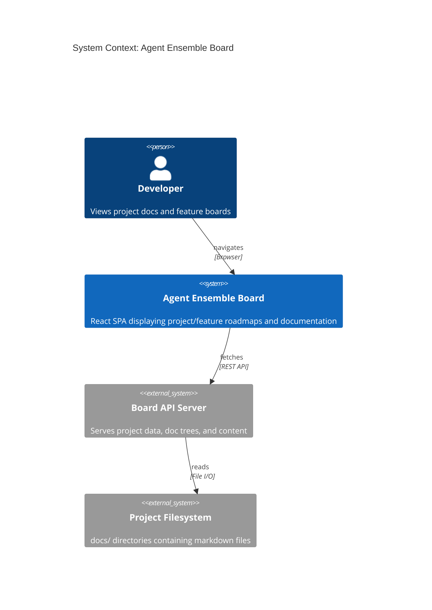
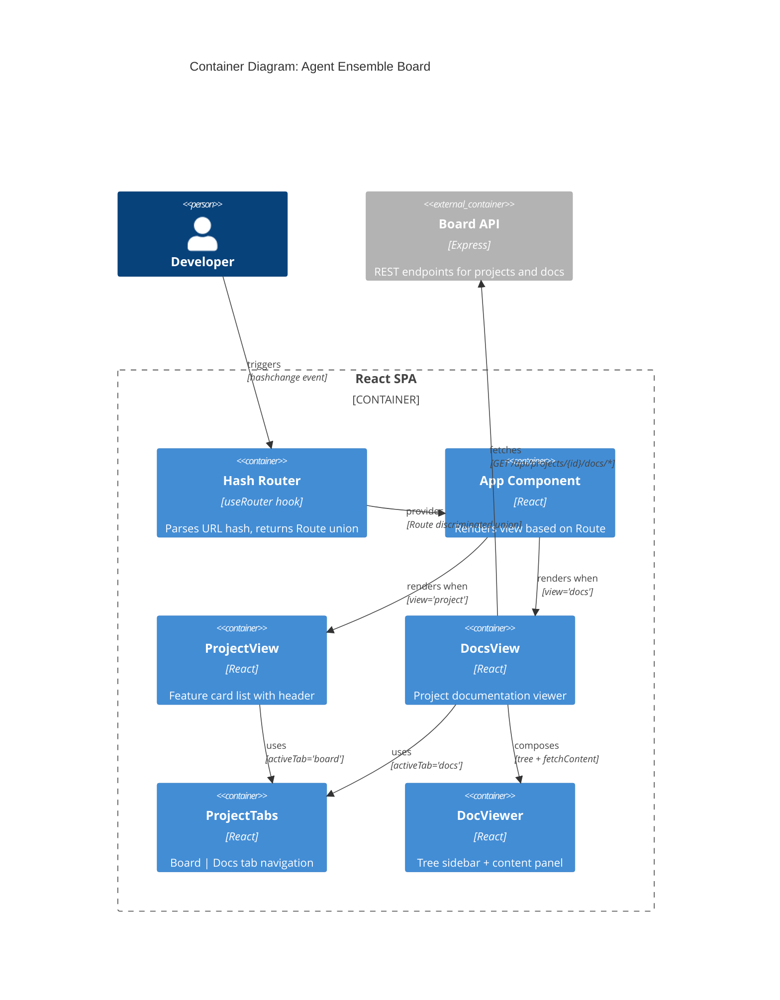
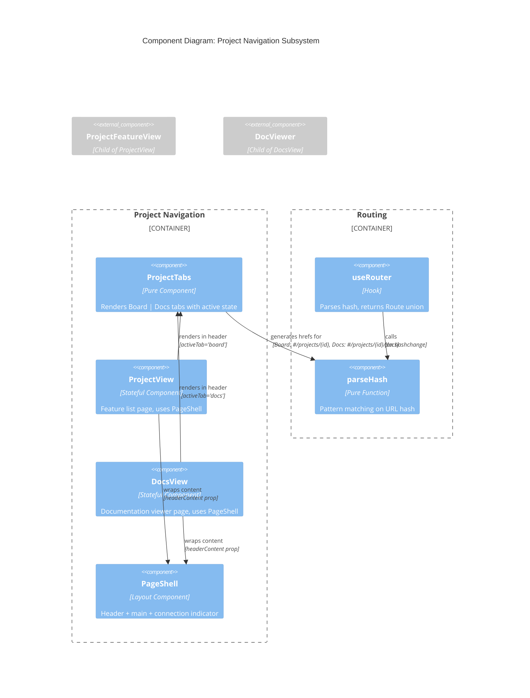

# Architecture Design: Project Docs Tab

## Overview

Add Board | Docs tab navigation to the project page header, replacing the plain "Agent Ensemble" title. Mirrors the navigation pattern established on the feature page (`FeatureNavHeader`).

## Change Summary

**Scope**: Minimal UI modification in existing React components
**Risk Level**: Low (reuses proven components)
**Estimated Files Modified**: 1 (App.tsx only - router already handles all routes)

## C4 System Context (Level 1)



## C4 Container (Level 2)



## C4 Component (Level 3) - Affected Subsystem



## Component Boundaries

### Modified Components

| Component | Current State | Target State |
|-----------|--------------|--------------|
| `ProjectView` | Plain `<h1>` header | Uses `ProjectTabs` with `activeTab="board"` |
| `DocsView` | Already uses `ProjectTabs` | No change (reference implementation) |
| `ProjectTabs` | Board href = `/projects/{id}/board` | Board href = `/projects/{id}` |

### Unchanged Components

- `DocViewer` - Reused as-is
- `useDocTree` - Reused as-is
- `PageShell` - Reused as-is
- `useRouter` - Already handles all routes correctly

## Integration Patterns

### Data Flow

```
URL Hash Change
     |
     v
parseHash() -----> Route { view: 'project' | 'docs', projectId }
     |
     v
App.renderRoute() --> ProjectView | DocsView
     |                      |
     v                      v
ProjectTabs           DocViewer
(activeTab)           (tree, fetchContent)
```

### API Integration

Project documentation already supported:
- `GET /api/projects/{projectId}/docs/tree` - Returns `DocTree`
- `GET /api/projects/{projectId}/docs/content?path={path}` - Returns markdown content

No new API endpoints required.

## Quality Attribute Strategies

| Attribute | Strategy |
|-----------|----------|
| Maintainability | Reuse existing `ProjectTabs` and `DocViewer` components |
| Consistency | Match feature page navigation pattern exactly |
| Testability | Pure functions for routing, stateless tab component |
| Usability | Single-click access to project docs |

## Deployment Architecture

No deployment changes. Frontend bundle includes all components. Existing API serves docs.
