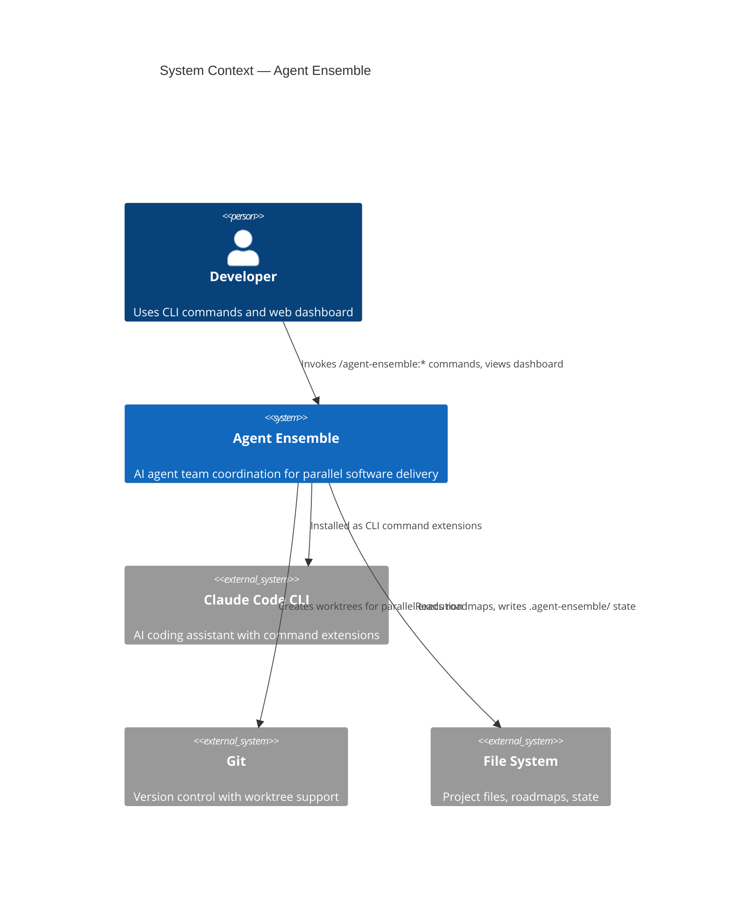
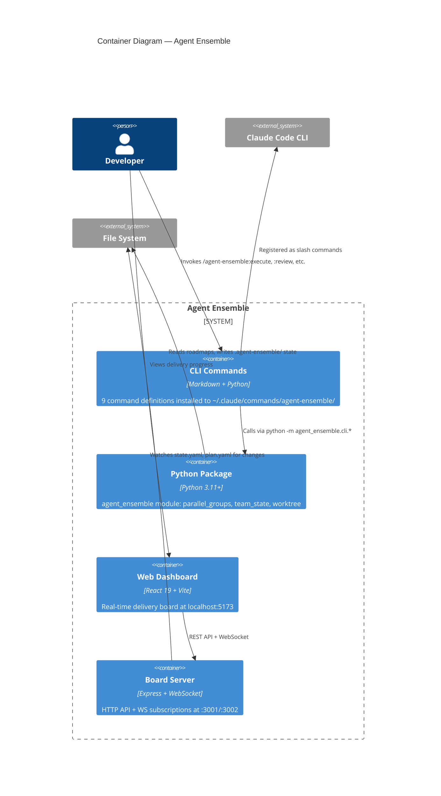

# Architecture Design — Rebranding to Agent Ensemble

## Decision Summary

The rebranding is a **naming transformation**, not an architectural change. The system's architecture, component boundaries, and data flows remain identical. This document defines the rename scope, execution strategy, and migration approach.

## Quality Attributes

| Attribute | Priority | Rationale |
|-----------|----------|-----------|
| **Consistency** | Critical | Every user-facing surface must reflect the new name simultaneously |
| **Correctness** | Critical | Renames must not break imports, paths, runtime behavior, or tests |
| **Completeness** | High | No residual references to old name in user-facing code |

## C4 System Context — Agent Ensemble



## C4 Container — Agent Ensemble



## Rename Scope by Container

### 1. CLI Commands Container

| File | Change Type | From | To |
|------|-------------|------|----|
| `commands/*.md` (x9) | Command prefix | `/nw-teams:*` | `/agent-ensemble:*` |
| `commands/*.md` | State dir paths | `.nw-teams/` | `.agent-ensemble/` |
| `commands/*.md` | Python module refs | `nw_teams.cli.*` | `agent_ensemble.cli.*` |

### 2. Python Package Container

| File | Change Type | From | To |
|------|-------------|------|----|
| `src/nw_teams/` | Directory rename | `nw_teams` | `agent_ensemble` |
| `src/nw_teams/__init__.py` | Docstring | `"nw-teams: ..."` | `"agent-ensemble: ..."` |
| `src/nw_teams/cli/__init__.py` | Docstring | `"nw-teams CLI tools."` | `"agent-ensemble CLI tools."` |
| `src/nw_teams/cli/worktree.py` | Display strings | `"nw-teams worktrees"` | `"agent-ensemble worktrees"` |
| `src/nw_teams/cli/team_state.py` | Usage examples | `nw_teams.cli.team_state` | `agent_ensemble.cli.team_state` |
| `src/nw_teams/cli/parallel_groups.py` | Usage examples | `nw_teams.cli.parallel_groups` | `agent_ensemble.cli.parallel_groups` |
| `src/nw_teams/cli/migrate_roadmap.py` | Usage examples | `nw_teams.cli.*` | `agent_ensemble.cli.*` |
| `pyproject.toml` | Package name | `"nw-teams"` | `"agent-ensemble"` |
| `pyproject.toml` | Description | `"...nWave framework"` | `"AI agent team orchestration for parallel delivery"` |

### 3. Web Dashboard Container

| File | Change Type | From | To |
|------|-------------|------|----|
| `board/index.html` | HTML title | `"NW Teams Board"` | `"Agent Ensemble"` |
| `board/src/App.tsx` | Header text (x3) | `"NW Teams Board"` | `"Agent Ensemble"` |
| `board/src/components/OverviewDashboard.tsx` | Empty state | `"NW Teams Board"` | `"Agent Ensemble"` |
| `board/package.json` | Package name | `"nw-teams-board"` | `"agent-ensemble"` |

### 4. Board Server Container

No code changes needed. The server uses dynamic paths from project configuration — no hardcoded `nw-teams` references in source files. Test fixtures use `nw-teams` in paths as example data, which should be updated for consistency.

### 5. Install Script

| File | Change Type | From | To |
|------|-------------|------|----|
| `install.sh` | Comment | `"nw-teams"` | `"agent-ensemble"` |
| `install.sh` | Command symlink | `commands/nw-teams` | `commands/agent-ensemble` |
| `install.sh` | Python symlink | `nw_teams` | `agent_ensemble` |
| `install.sh` | Uninstall paths | `commands/nw-teams`, `nw_teams` | `commands/agent-ensemble`, `agent_ensemble` |
| `install.sh` | Summary output | `/nw-teams:*` | `/agent-ensemble:*` |
| `install.sh` | **Migration** | (new) | Clean up old `nw-teams` paths before install |

### 6. Configuration & Metadata

| File | Change Type | From | To |
|------|-------------|------|----|
| `.gitignore` | State dir | `.nw-teams/` | `.agent-ensemble/` |
| `board/.nw-board-projects.json` | Project ID | `"nw-teams"` | Unchanged (dynamic, user-specific) |

### 7. Documentation

All files in `docs/` referencing the old name. Bulk find-and-replace with manual review.

### 8. Tests

| Location | Change Type |
|----------|-------------|
| `tests/test_*.py` | Module import paths |
| `board/server/__tests__/*.test.ts` | Example path strings (cosmetic) |
| `board/src/__tests__/*.test.tsx` | Display name assertions |

## Migration Strategy

### Install Script Migration

The install script must handle the transition from old to new paths:

```
install() {
  # 1. Clean up old nw-teams paths if they exist
  cleanup_old_installation()

  # 2. Install with new agent-ensemble paths
  link_commands()    # -> ~/.claude/commands/agent-ensemble
  link_python()      # -> ~/.claude/lib/python/agent_ensemble
  configure_pythonpath()
}

cleanup_old_installation() {
  # Remove old command symlink
  if symlink exists at ~/.claude/commands/nw-teams; then
    remove it
  fi
  # Remove old Python symlink
  if symlink exists at ~/.claude/lib/python/nw_teams; then
    remove it
  fi
}
```

### State Directory Migration

The `.nw-teams/` → `.agent-ensemble/` change only affects **command file documentation** (the paths are passed as CLI arguments, not hardcoded in Python source). Active projects with existing `.nw-teams/` state continue to work — state directory is an argument, not a constant.

### Repository Folder Rename

Manual step after all code changes: `mv nw-teams agent-ensemble`. This is outside git's scope and handled by the developer.

## Execution Order

The rename must be executed in dependency order to avoid broken imports:

```
Phase 1: Python package (foundation)
  1. Rename src/nw_teams/ → src/agent_ensemble/
  2. Update pyproject.toml
  3. Update all internal Python references
  4. Update Python tests

Phase 2: CLI commands (depends on Python module name)
  5. Update all command .md files (prefix + module refs + state paths)

Phase 3: Web UI (independent)
  6. Update board/package.json
  7. Update board/index.html
  8. Update App.tsx, OverviewDashboard.tsx
  9. Update board tests

Phase 4: Infrastructure
  10. Update install.sh (with migration cleanup)
  11. Update .gitignore

Phase 5: Documentation
  12. Bulk rename in all docs/

Phase 6: Verification
  13. Run all Python tests
  14. Run all board tests (vitest)
  15. Grep for residual references
```

## No-Change Boundaries

These should **not** change as part of the rebranding:

- Architecture, component boundaries, data flows
- API endpoints or WebSocket protocol
- File formats (YAML schemas, JSON structures)
- Git branch naming conventions
- Development paradigm (functional programming)
- Test strategy or tooling
