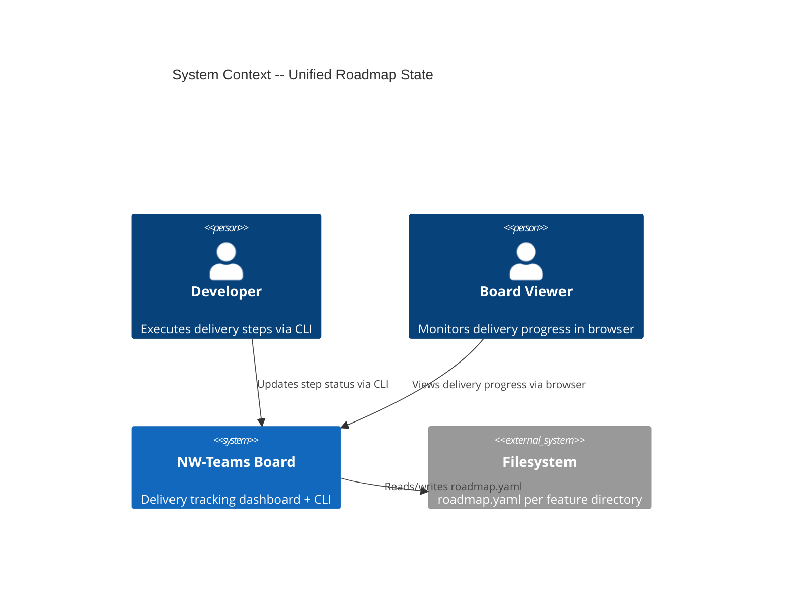
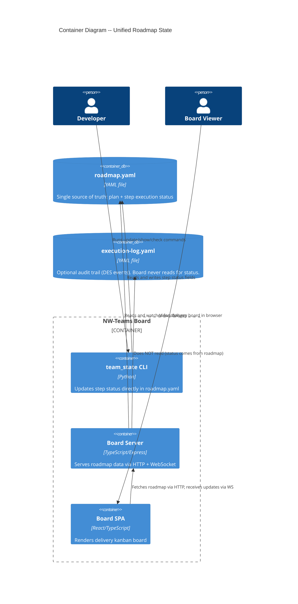
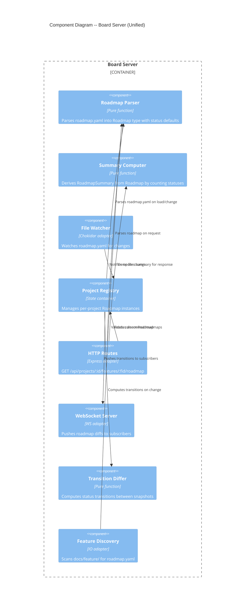

# Unified Roadmap State -- Architecture Design

## 1. System Context

The NW-Teams delivery system currently splits a single concern (feature execution tracking) across three files: `roadmap.yaml` (plan), `execution-log.yaml` (audit events), and `state.yaml` (derived step statuses). This design unifies plan and status into `roadmap.yaml` as the single source of truth.

### Problem Quantified

| Metric | Current (3-file) | Unified (1-file) |
|--------|-------------------|-------------------|
| Files read per feature load | 3 (roadmap + exec-log + state) | 1 (roadmap) |
| Parser functions | 6 (`parseStateYaml`, `parsePlanYaml`, `parseFeatureRoadmap`, `parseFeatureExecutionLog`, `parseDesRoadmap`, `parseDesExecutionLog`) | 2 (`parseRoadmap`, legacy `parseDesExecutionLog` for migration) |
| Type definitions | 2 separate models (`ExecutionPlan` + `DeliveryState`) | 1 unified model (`Roadmap`) |
| CLI commands | 5 (`init`, `update`, `show`, `check`, `should-worktree`) | 3 (`update`, `show`, `check`) -- `init` eliminated |
| Intermediate files generated | 2 (`plan.yaml`, `state.yaml`) | 0 |
| HTTP endpoints per feature | 2 (`/plan`, `/state`) | 1 (`/roadmap`) |

### C4 System Context (L1)



## 2. Unified Roadmap Schema

### Step fields (new additions to existing roadmap format)

Each step in the roadmap gains optional execution-state fields. Absent fields have implicit defaults, preserving backward compatibility.

| Field | Type | Default (when absent) | Source |
|-------|------|-----------------------|--------|
| `status` | StepStatus | `'pending'` | New -- execution state |
| `teammate_id` | string or null | `null` | From state.yaml |
| `started_at` | ISO timestamp or null | `null` | From state.yaml |
| `completed_at` | ISO timestamp or null | `null` | From state.yaml |
| `review_attempts` | number | `0` | From state.yaml |

### Existing step fields (unchanged)

`id`, `name`, `description`, `files_to_modify`, `dependencies`, `criteria`, `time_estimate`

### Example: roadmap.yaml with embedded status

```yaml
roadmap:
  project_id: directory-browser
  created_at: '2026-03-02T18:44:29Z'
  total_steps: 8
  phases: 2
phases:
- id: '01'
  name: Server-side browse infrastructure
  steps:
  - id: 01-01
    name: Add shared browse types
    files_to_modify:
      - board/shared/types.ts
    dependencies: []
    criteria:
      - BrowseEntry has readonly name and path fields
    status: approved
    teammate_id: crafter-01-01
    started_at: '2026-03-02T18:50:00Z'
    completed_at: '2026-03-02T18:51:35Z'
    review_attempts: 1
  - id: 01-02
    name: Create browse.ts pure validation core
    files_to_modify:
      - board/server/browse.ts
    dependencies:
      - 01-01
    criteria:
      - validateBrowsePath returns Result with validated path or BrowseError
    status: in_progress
    teammate_id: crafter-01-02
    started_at: '2026-03-02T18:53:45Z'
  - id: 01-03
    name: Create browse.ts IO shell adapter
    files_to_modify:
      - board/server/browse.ts
    dependencies:
      - 01-02
    # No status field = pending (implicit default)
```

### Backward compatibility rules

1. Missing `status` field on a step implies `'pending'`
2. `id` is the only accepted identifier field (no dual-format)
3. Missing `teammate_id`, `started_at`, `completed_at`, `review_attempts` all default to null/0
4. Existing roadmaps work with zero modifications

## 3. Simplified Type System

### Types to ADD

```
RoadmapStep
  id: string
  name: string
  description?: string
  files_to_modify: readonly string[]
  dependencies: readonly string[]
  criteria: readonly string[]
  status: StepStatus          -- default 'pending'
  teammate_id: string | null  -- default null
  started_at: string | null   -- default null
  completed_at: string | null -- default null
  review_attempts: number     -- default 0

RoadmapPhase
  id: string
  name: string
  description?: string
  steps: readonly RoadmapStep[]

RoadmapMeta
  project_id?: string
  created_at?: string
  total_steps?: number
  phases?: number
  status?: string           -- roadmap-level review status
  reviewer?: string
  approved_at?: string

Roadmap
  roadmap: RoadmapMeta
  phases: readonly RoadmapPhase[]

RoadmapSummary                -- COMPUTED, never stored
  total_steps: number
  total_phases: number
  completed: number
  failed: number
  in_progress: number
  pending: number
```

### Types to DEPRECATE (keep for backward compat during migration)

- `ExecutionPlan`, `ExecutionLayer`, `PlanStep`, `PlanSummary` -- replaced by `Roadmap`
- `DeliveryState`, `StateSummary`, `StepState`, `TeammateState` -- replaced by `Roadmap` + computed `RoadmapSummary`

### Types to KEEP unchanged

- `Result<T, E>`, `ok`, `err` -- foundational
- `StepStatus`, `STEP_STATUSES` -- reused directly in `RoadmapStep`
- `ParseError` -- reused by new parser
- `ProjectId`, `FeatureId` -- unchanged
- `FeatureSummary` -- recomputed from `Roadmap` instead of plan+state
- `StateTransition` -- still used for WebSocket diff notifications

### Summary computation (pure function)

The `RoadmapSummary` is never stored. It is computed at read time by counting step statuses:

```
computeRoadmapSummary: Roadmap -> RoadmapSummary
  total_steps = count all steps across phases
  completed = count steps where status == 'approved'
  failed = count steps where status == 'failed'
  in_progress = count steps where status in {'claimed', 'in_progress', 'review'}
  pending = total_steps - completed - failed - in_progress
  total_phases = count phases
```

## 4. C4 Container Diagram (L2)



## 5. C4 Component Diagram (L3) -- Board Server



## 6. Parser Changes

### New: `parseRoadmap`

Single parser replaces `parseFeatureRoadmap` + `parseFeatureExecutionLog`. Reads `roadmap.yaml`, applies defaults for missing status fields.

**Input**: YAML string (roadmap.yaml content)
**Output**: `Result<Roadmap, ParseError>`

**Default rules**:
- `id` used directly (no normalization)
- Missing `status` -> `'pending'`
- Missing `teammate_id` -> `null`
- Missing `started_at` -> `null`
- Missing `completed_at` -> `null`
- Missing `review_attempts` -> `0`
- Missing `dependencies` -> `[]`
- Missing `criteria` -> `[]`
- Missing `files_to_modify` -> `[]`

### Deprecated parsers (kept for migration period)

- `parseDesExecutionLog` -- still available for tools that need audit trail data
- `parseStateYaml` -- still available for reading legacy state.yaml during migration

### Removed parsers (after migration)

- `parsePlanYaml` -- plan.yaml no longer generated
- `parseFeatureRoadmap` -- replaced by `parseRoadmap`
- `parseFeatureExecutionLog` -- board no longer reads execution-log for status

## 7. API Changes

### Feature-level endpoints

| Current | Unified | Notes |
|---------|---------|-------|
| `GET /features/:fid/plan` | REMOVED | |
| `GET /features/:fid/state` | REMOVED | |
| (none) | `GET /features/:fid/roadmap` | Returns full `Roadmap` with status fields |

### Response shape for `GET /features/:fid/roadmap`

Returns the parsed `Roadmap` object directly. Summary is computed server-side and included in response.

```
{
  roadmap: { project_id, created_at, total_steps, ... },
  phases: [
    {
      id: "01",
      name: "Foundation",
      steps: [
        {
          id: "01-01",
          name: "Add types",
          status: "approved",
          teammate_id: "crafter-01-01",
          ...
        }
      ]
    }
  ],
  summary: {          // computed, not stored
    total_steps: 8,
    completed: 5,
    in_progress: 1,
    failed: 0,
    pending: 2,
    total_phases: 2
  }
}
```

### Project-level endpoints

| Current | Unified | Notes |
|---------|---------|-------|
| `GET /projects/:id/plan` | DEPRECATE | Keep during migration for backward compat |
| `GET /projects/:id/state` | DEPRECATE | Keep during migration |

### WebSocket protocol changes

**Migration strategy**: Existing `init` and `update` WS messages continue working unchanged for project-level `state.yaml` watchers (Phase 1-2). In Phase 3, when registry switches to watching `roadmap.yaml`, the existing `update` message is reused with `DeliveryState` derived from `Roadmap` via bridge function `roadmapToDeliveryState`. No new WS message type needed -- the bridge function produces the same `DeliveryState` shape subscribers already consume.

In Phase 4 (cleanup), if all frontend consumers have migrated to `Roadmap` types, the WS protocol can optionally switch to sending `Roadmap` directly. This is a separate decision for a future ADR -- not required for this feature.

## 8. CLI Changes

### team_state.py simplification

**Current commands**: `init`, `update`, `show`, `check`, `should-worktree`
**Unified commands**: `update`, `show`, `check`

| Command | Current behavior | Unified behavior |
|---------|------------------|------------------|
| `init` | Reads plan.yaml, generates state.yaml | REMOVED -- roadmap IS the initial state |
| `update` | Reads/writes state.yaml | Reads/writes roadmap.yaml step status fields |
| `show` | Reads state.yaml, displays progress | Reads roadmap.yaml, computes summary, displays progress |
| `check` | Reads state.yaml, checks layer completion | Reads roadmap.yaml, checks phase completion |
| `should-worktree` | Reads state.yaml for file conflicts | Reads roadmap.yaml for file conflicts |

### New CLI interface

```
team_state update roadmap.yaml --step 01-01 --status approved [--teammate TEAMMATE_ID]
team_state show roadmap.yaml
team_state check roadmap.yaml --phase 01
```

### CLI update logic (pure core)

1. Read roadmap.yaml
2. Find step by ID (search across all phases)
3. Apply status transition + timestamp fields
4. Write roadmap.yaml back (preserve all other fields unchanged)

Key: the CLI writes the YAML back preserving comments and structure as much as possible. Use `ruamel.yaml` (MIT license) for round-trip YAML preservation instead of `pyyaml` which drops comments.

### parallel_groups.py changes

- `plan` subcommand: REMOVED -- no longer generates plan.yaml
- `analyze` subcommand: UNCHANGED -- still useful for dependency analysis
- Input stays roadmap.yaml, output format changes (no more plan.yaml generation)

## 9. Feature Discovery Changes

### Current flow
```
scanFeatureDirsFs -> for each feature:
  loadFeatureArtifactsFs -> reads roadmap.yaml + execution-log.yaml
  parseFeatureRoadmap -> ExecutionPlan
  parseFeatureExecutionLog -> DeliveryState
  deriveFeatureSummary(featureId, plan, state) -> FeatureSummary
```

### Unified flow
```
scanFeatureDirsFs -> for each feature:
  loadFeatureRoadmapFs -> reads roadmap.yaml only
  parseRoadmap -> Roadmap
  deriveFeatureSummary(featureId, roadmap) -> FeatureSummary
```

`FeatureSummary` type stays the same. `hasExecutionLog` field semantics change: reflects whether any step has non-pending status (execution has started). Or alternatively, this field can be derived from `completed > 0 || inProgress > 0`.

## 10. Registry and Watcher Changes

### Current
- Registry watches `state.yaml` per project
- On state.yaml change: re-parse, compute transitions, notify subscribers
- `plan.yaml` read once at registration time

### Unified (feature-level)
- Registry watches `roadmap.yaml` per feature (or per project directory)
- On roadmap.yaml change: re-parse, compute transitions from old->new status, notify subscribers
- No separate plan loading -- roadmap contains everything

### Discovery changes
- `scanProjectDirsFs` currently checks for `state.yaml` presence to identify projects
- Change: check for `docs/feature/*/roadmap.yaml` OR existing project manifest entry
- Manifest-based projects (added via POST /api/projects) remain unaffected

## 11. Frontend Changes

### useFeatureState hook
- Currently fetches `/features/:fid/plan` + `/features/:fid/state` in parallel
- Change: fetch single `/features/:fid/roadmap` endpoint
- Derive plan-equivalent data (layers = phases, steps with files_to_modify) from Roadmap
- Derive state-equivalent data (step statuses, summary) from Roadmap

### KanbanBoard component
- Currently receives `ExecutionPlan` (for structure) + `DeliveryState` (for status)
- Change: receives `Roadmap` -- phases are the "layers", steps contain both structure and status
- `blockedStepIds` computation: uses `dependencies` from roadmap steps (replaces `conflicts_with` from plan)

### Type adaptation layer (migration bridge)
During migration, a pure function maps `Roadmap` to the existing `ExecutionPlan` + `DeliveryState` shape:

```
roadmapToExecutionPlan: Roadmap -> ExecutionPlan
roadmapToDeliveryState: Roadmap -> DeliveryState
```

This allows incremental frontend migration: components consuming old types work unchanged while we migrate one component at a time.

## 12. Migration Strategy

### Phase 1: Add unified parser + new types (additive, no breakage)
- Add `Roadmap`, `RoadmapStep`, `RoadmapPhase`, `RoadmapSummary` types
- Add `parseRoadmap` parser
- Add `computeRoadmapSummary` pure function
- Add `roadmapToExecutionPlan` + `roadmapToDeliveryState` bridge functions

### Phase 2: Add unified endpoint + CLI update (parallel path)
- Add `GET /features/:fid/roadmap` endpoint (alongside existing plan/state endpoints)
- Modify `team_state.py update` to write directly to roadmap.yaml
- Remove `team_state.py init` command
- Switch `parallel_groups.py` to skip plan.yaml generation

### Phase 3: Switch consumers to unified path
- Feature discovery reads only roadmap.yaml
- `useFeatureState` hook fetches `/roadmap` endpoint
- `KanbanBoard` consumes `Roadmap` directly (or via bridge)
- Registry watches roadmap.yaml instead of state.yaml

### Phase 4: Remove deprecated code
- Remove `parseStateYaml`, `parsePlanYaml`, `parseFeatureExecutionLog`
- Remove `ExecutionPlan`, `DeliveryState`, `StepState`, `TeammateState` types
- Remove plan/state HTTP endpoints
- Remove `plan.yaml` and `state.yaml` generation

## 13. Quality Attribute Strategies

### Simplicity
- 3 files -> 1 file per feature
- 2 type models -> 1 type model
- 6 parsers -> 1 parser (+ legacy during migration)
- Summary computed, not stored (eliminates sync bugs)

### Maintainability
- No `init` command -- roadmap is self-contained
- No plan.yaml generation -- eliminates a build step
- No state.yaml sync -- eliminates a failure mode
- CLI writes to the same file the board reads

### Backward compatibility
- All new fields are optional with sensible defaults
- Existing roadmaps work without modification
- Bridge functions allow incremental migration
- Deprecated endpoints kept during transition

### Testability
- Pure `parseRoadmap` function: easy to unit test with YAML fixtures
- Pure `computeRoadmapSummary`: simple input->output test
- Pure bridge functions: verify mapping correctness
- CLI update: test that YAML round-trips preserve structure

## 14. Technology Stack

| Component | Technology | License | Rationale |
|-----------|-----------|---------|-----------|
| YAML parsing (TS) | js-yaml | MIT | Already in use |
| YAML round-trip (Python) | ruamel.yaml | MIT | Preserves comments/formatting on write |
| File watching | chokidar | MIT | Already in use |
| HTTP server | Express | MIT | Already in use |
| WebSocket | ws | MIT | Already in use |

No new dependencies beyond `ruamel.yaml` for Python CLI. All existing dependencies stay.
