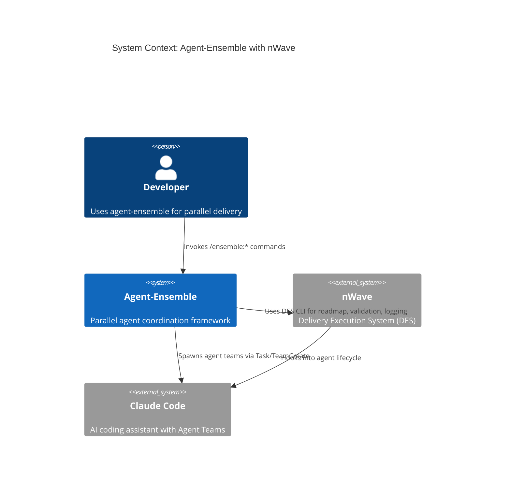
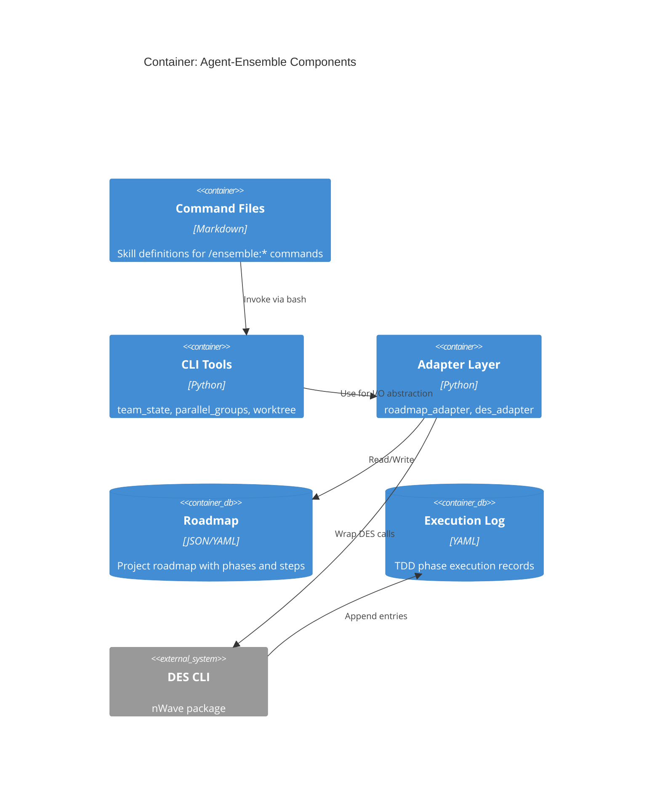
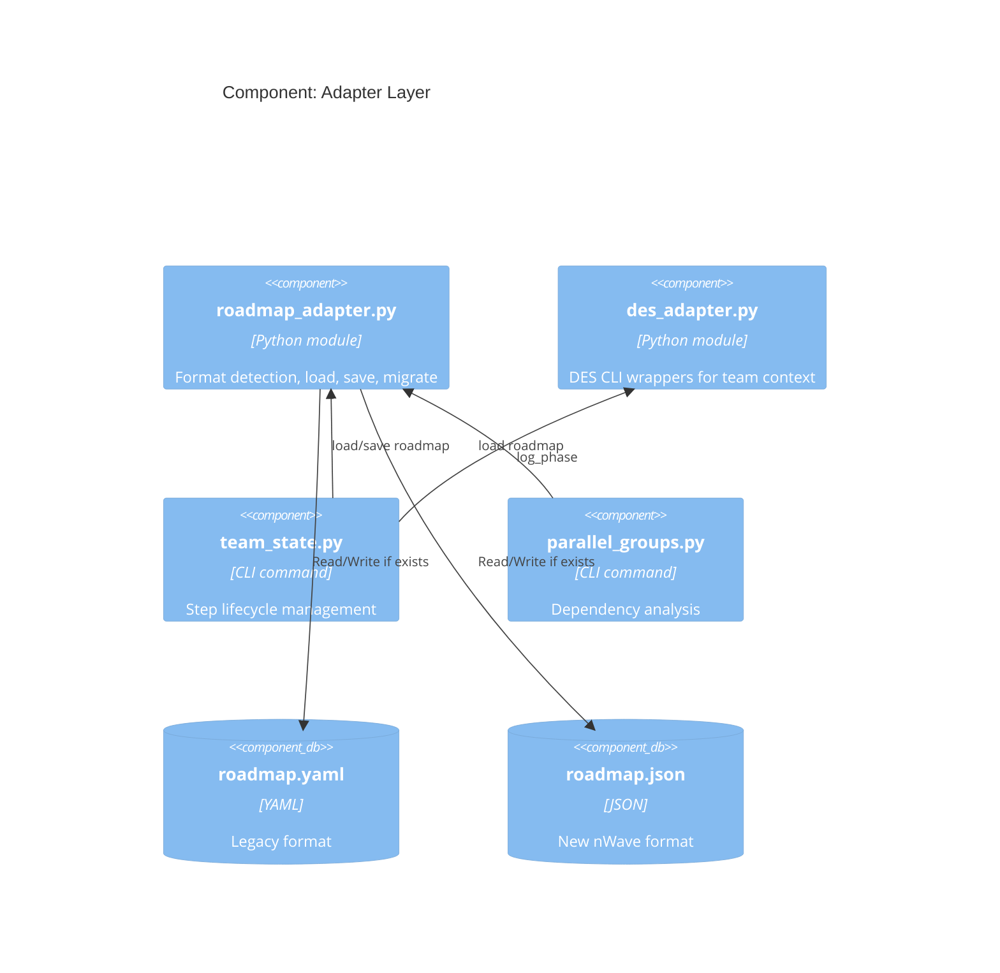
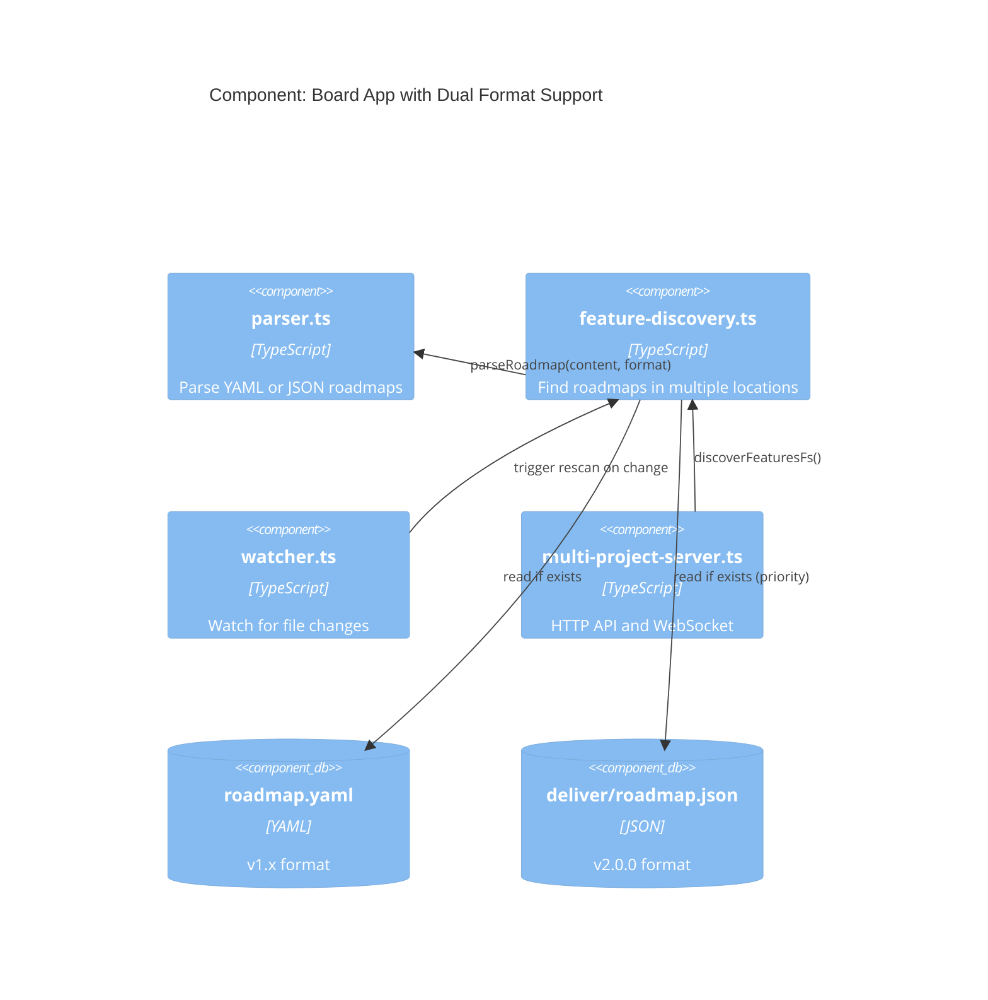

# Architecture Design: Update Agent-Ensemble for nWave v2.0.0 Compatibility

## Problem Statement

nWave v2.0.0 (released 2026-03-05) introduced breaking changes that broke the agent-ensemble framework.

**Source**: [nWave v2.0.0 Release Notes](https://github.com/nWave-ai/nWave/releases/tag/v2.0.0)

### Confirmed Breaking Changes

| Change | Before (v1.x) | After (v2.0.0) |
|--------|---------------|----------------|
| **Tool API** | `Task` tool | `Agent` tool (Claude Code v2.1.63) |
| **Roadmap format** | `roadmap.yaml` | `roadmap.json` |
| **Execution log** | `execution-log.yaml` | `execution-log.json` |
| **Directory structure** | `docs/feature/{id}/roadmap.yaml` | `docs/feature/{id}/deliver/roadmap.json` |
| **Project ID naming** | `project-id` | `feature-id` |

### Root Cause

From release notes:
> **fix(des): migrate Task tool to Agent tool (Claude Code v2.1.63)**

Claude Code renamed its `Task` tool to `Agent` tool. DES hooks that intercepted Task tool calls no longer fire.

## Current Architecture (Broken State)

```
┌─────────────────────────────────────────────────────────────────────────┐
│                     Agent-Ensemble Commands                              │
│  ~/.claude/commands/ensemble/*.md                                        │
│  (execute, deliver, design, discover, distill, etc.)                     │
├─────────────────────────────────────────────────────────────────────────┤
│                                                                          │
│  ┌─────────────────────────┐        ┌─────────────────────────┐         │
│  │   agent_ensemble.cli    │        │        des.cli          │ ← nWave │
│  │   - team_state.py       │        │   - roadmap.py          │  v1.x   │
│  │   - parallel_groups.py  │        │   - verify_deliver_...  │         │
│  │   - worktree.py         │        │   - log_phase.py        │         │
│  │   - migrate_roadmap.py  │        │                         │         │
│  └───────────┬─────────────┘        └───────────┬─────────────┘         │
│              │                                  │                        │
│              │    Uses ruamel.yaml              │  Uses yaml             │
│              │    Expects roadmap.yaml          │  Outputs YAML          │
│              │    Spawns via Task tool          │  Hooks Task tool       │
│              │                                  │                        │
│              └──────────────┬───────────────────┘                        │
│                             │                                            │
│                             ▼                                            │
│                   docs/feature/{id}/roadmap.yaml                         │
│                                                                          │
│   BROKEN: nWave v2.0.0 expects:                                          │
│     - Agent tool (not Task)                                              │
│     - docs/feature/{id}/deliver/roadmap.json                             │
│     - execution-log.json                                                 │
│                                                                          │
└─────────────────────────────────────────────────────────────────────────┘
```

### Breaking Change 1: Tool API Migration

**nWave v2.0.0 execute.md** (from GitHub):
```python
# Before (v1.x)
Task(
    subagent_type="{agent}",
    model=rigor_agent_model,
    max_turns=45,
    prompt=...,
)

# After (v2.0.0)
Agent(
    subagent_type="{agent}",
    model=rigor_agent_model,
    max_turns=45,
    prompt=...,
)
```

DES pre-tool-use hooks now listen for `Agent` tool, not `Task` tool.

### Breaking Change 2: File Format and Paths

| Aspect | v1.x | v2.0.0 |
|--------|------|--------|
| Roadmap path | `docs/feature/{id}/roadmap.yaml` | `docs/feature/{id}/deliver/roadmap.json` |
| Exec log path | `docs/feature/{id}/execution-log.yaml` | `docs/feature/{id}/deliver/execution-log.json` |
| Format | YAML | JSON |
| Subdirectory | none | `deliver/` |

### Impact on Agent-Ensemble

1. **CLI tools broken**: `team_state.py`, `parallel_groups.py` use `ruamel.yaml` and expect `.yaml` files
2. **Command files outdated**: Reference old paths and `Task` tool
3. **DES hooks don't fire**: Agent-ensemble still uses `Task` tool (via TeamCreate → Task)
4. **Path mismatch**: Ensemble expects `roadmap.yaml`, nWave v2 expects `deliver/roadmap.json`

## Proposed Architecture (Design Only)

### Strategy: Adapter Layer + Dual-Format Support

```
┌─────────────────────────────────────────────────────────────────────────┐
│                     Agent-Ensemble Commands                              │
│  ~/.claude/commands/ensemble/*.md                                        │
│  (Updated to support both YAML and JSON)                                 │
├─────────────────────────────────────────────────────────────────────────┤
│                                                                          │
│  ┌─────────────────────────────────────────────────────────────────┐    │
│  │                    ADAPTER LAYER (NEW)                          │    │
│  │                                                                  │    │
│  │  ┌─────────────────┐    ┌─────────────────┐                     │    │
│  │  │ roadmap_adapter │    │  des_adapter    │                     │    │
│  │  │ - load()        │    │ - wrap_task()   │                     │    │
│  │  │ - save()        │    │ - init_roadmap()│                     │    │
│  │  │ - detect_format │    │ - validate()    │                     │    │
│  │  │ - migrate()     │    │ - log_phase()   │                     │    │
│  │  └────────┬────────┘    └────────┬────────┘                     │    │
│  │           │                      │                               │    │
│  └───────────┼──────────────────────┼───────────────────────────────┘    │
│              │                      │                                    │
│  ┌───────────▼──────────────────────▼───────────────────────────────┐    │
│  │                    agent_ensemble.cli                            │    │
│  │   - team_state.py (uses roadmap_adapter)                         │    │
│  │   - parallel_groups.py (uses roadmap_adapter)                    │    │
│  │   - worktree.py                                                  │    │
│  └──────────────────────────────────────────────────────────────────┘    │
│                                                                          │
│                             │                                            │
│                             ▼                                            │
│                   roadmap.json OR roadmap.yaml                           │
│                   (adapter detects and handles both)                     │
│                                                                          │
└─────────────────────────────────────────────────────────────────────────┘
```

## Component Design

### 1. Roadmap Adapter (`roadmap_adapter.py`)

**Purpose**: Abstract the roadmap file format so CLI tools work with both YAML and JSON.

```python
# Pure functions for roadmap I/O
def detect_format(project_dir: Path) -> Literal["yaml", "json", None]:
    """Detect which roadmap format exists in project dir."""

def load_roadmap(project_dir: Path) -> tuple[dict, Literal["yaml", "json"]]:
    """Load roadmap, auto-detecting format. Returns (data, format)."""

def save_roadmap(data: dict, project_dir: Path, fmt: Literal["yaml", "json"]) -> None:
    """Save roadmap in specified format, preserving comments if YAML."""

def migrate_yaml_to_json(project_dir: Path) -> None:
    """One-time migration of roadmap.yaml to roadmap.json."""
```

**Design decisions:**
- Prefer JSON if both exist (nWave is moving to JSON)
- Preserve YAML comments during round-trip if still using YAML
- Migration is explicit, not automatic (user control)

### 2. DES Adapter (`des_adapter.py`)

**Purpose**: Wrap DES CLI calls to work correctly with agent teams.

```python
def init_roadmap(project_id: str, goal: str, output_path: Path, **kwargs) -> int:
    """Wrap des.cli.roadmap init, handling format differences."""

def validate_roadmap(roadmap_path: Path) -> tuple[bool, list[str]]:
    """Wrap des.cli.roadmap validate, adapting to JSON schema if needed."""

def verify_deliver_integrity(project_dir: Path) -> tuple[bool, str]:
    """Wrap des.cli.verify_deliver_integrity."""

def log_phase(project_dir: Path, step_id: str, phase: str, status: str, data: str) -> int:
    """Wrap des.cli.log_phase for team context."""
```

### 3. Team State Updates (`team_state.py` modifications)

**Current**: Uses `ruamel.yaml.YAML()` directly.

**Proposed**: Use roadmap_adapter for all file I/O.

```python
# Before
def _load_roadmap(path: Path):
    yaml = YAML()
    yaml.preserve_quotes = True
    return yaml, yaml.load(path.read_text())

# After
def _load_roadmap(path: Path):
    from agent_ensemble.adapters.roadmap_adapter import load_roadmap
    data, fmt = load_roadmap(path.parent)
    return data, fmt

def _save_roadmap(data: dict, path: Path, fmt: str):
    from agent_ensemble.adapters.roadmap_adapter import save_roadmap
    save_roadmap(data, path.parent, fmt)
```

### 4. Command File Updates

All `commands/ensemble/*.md` files need updates:

| File | Changes Required |
|------|------------------|
| `execute.md` | Update roadmap path references (`.yaml` → format-agnostic) |
| `deliver.md` | Update CLI invocations to use adapters |
| `design.md` | Update architect spawn prompts |
| `discover.md` | Minimal changes (no roadmap dependency) |
| `distill.md` | Minimal changes |
| All | Update DES CLI calls to use adapter wrappers |

## C4 Diagrams

### System Context



### Container Diagram



### Component Diagram: Adapter Layer



## Migration Strategy

### Phase 1: Adapter Layer (Non-Breaking)
1. Create `src/agent_ensemble/adapters/` module
2. Implement `roadmap_adapter.py` with dual-format support
3. Implement `des_adapter.py` with DES CLI wrappers
4. Update `team_state.py` to use adapters
5. Update `parallel_groups.py` to use adapters

### Phase 2: Command Updates
1. Update `commands/ensemble/execute.md` CLI invocations
2. Update `commands/ensemble/deliver.md` workflow
3. Update remaining command files
4. Add migration command to CLI

### Phase 3: Sync with nWave
1. Determine exact changes in DES CLI API
2. Update adapters to match new DES signatures
3. Test full workflow with latest nWave

## Confirmed from nWave v2.0.0 Source (Validated)

Based on detailed GitHub analysis of nWave v2.0.0 source code:

### Hook Registration (des_plugin.py)

The DES plugin registers hooks with a **matcher for "Agent"** tool:

```python
# From des_plugin.py - hook registration
pretooluse_hook = {
    "matcher": "Agent",  # <-- KEY: matches "Agent" tool, not "Task"
    "hooks": [{"type": "command", "command": new_pretask_command}],
}
```

**Implication**: DES hooks will NOT fire for `Task` tool calls. They only fire for `Agent` tool.

### Tool Name in Hook Input

From `claude_code_hook_adapter.py`:
```python
# Claude Code sends: {"tool_name": "Agent", "tool_input": {...}, ...}
prompt = tool_input.get("prompt", "")
```

**Implication**: Claude Code v2.1.63 sends `tool_name: "Agent"` not `tool_name: "Task"`.

### Enforcement Policy (des_enforcement_policy.py)

The enforcement policy checks for DES markers in **Agent prompts**:
```python
class DesEnforcementPolicy:
    """Enforces DES markers on Task prompts that reference step IDs."""
    # Note: Comments still say "Task" but code works with Agent tool

    STEP_ID_PATTERN = re.compile(r"(?<!\d{4}-)\b\d{2}-\d{2}\b")
    DES_MARKER = "DES-VALIDATION : required"
    EXEMPT_MARKER = "DES-ENFORCEMENT : exempt"
```

**Implication**: Step ID pattern matching is unchanged. DES markers work the same way.

### Execution Log Schema (execution-log-template.json)

```json
{
  "project_id": "",
  "created_at": "",
  "total_steps": 0,
  "events": []
}
```

**Implication**: Same structure as YAML, just JSON format. No field changes.

### Roadmap Schema (roadmap-schema.json)

```json
{
  "schema_version": "1.0",
  "required_fields": {
    "roadmap": ["project_id", "created_at", "total_steps", "phases"],
    "phase": ["id", "name", "steps"],
    "step": ["id", "name", "criteria"]
  },
  "id_patterns": {
    "phase_id": "^\\d{2}$",
    "step_id": "^\\d{2}-\\d{2}$"
  }
}
```

**Implication**: Same schema structure as YAML version. Field names unchanged.

### Write/Edit Guards

DES also guards direct writes to execution-log.json:
```python
if file_path and file_path.endswith("execution-log.json"):
    # Block direct writes, require CLI usage
```

**Implication**: Must use `des.cli.log_phase` to write execution log entries.

### Files Changed in Task→Agent Migration

```
plugins/nw/scripts/des/adapters/drivers/hooks/claude_code_hook_adapter.py
plugins/nw/scripts/des/application/pre_tool_use_service.py
plugins/nw/scripts/des/domain/des_enforcement_policy.py
plugins/nw/scripts/des/ports/driver_ports/pre_tool_use_port.py
src/des/adapters/drivers/hooks/claude_code_hook_adapter.py
src/des/application/pre_tool_use_service.py
src/des/domain/des_enforcement_policy.py
src/des/ports/driver_ports/pre_tool_use_port.py
```

### Roadmap Format (from v2.0.0 execute.md)

```yaml
# Context Files Required (v2.0.0)
- docs/feature/{feature-id}/deliver/roadmap.json
- docs/feature/{feature-id}/deliver/execution-log.json
```

### Summary of Breaking Changes (Validated)

| Change | Confirmed | Impact on Ensemble |
|--------|-----------|-------------------|
| Hook matcher: `"Agent"` not `"Task"` | ✅ Yes | Must use Agent tool in commands |
| Roadmap: JSON not YAML | ✅ Yes | CLI and board need JSON support |
| Execution log: JSON not YAML | ✅ Yes | CLI needs JSON support |
| Path: `deliver/` subdirectory | ✅ Yes | Update all path references |
| Schema structure | ✅ Unchanged | Validation logic can stay same |
| DES markers | ✅ Unchanged | `DES-VALIDATION`, `DES-STEP-ID` same |
| Step ID pattern | ✅ Unchanged | `\d{2}-\d{2}` same |

## Technology Stack

| Component | Technology | Rationale |
|-----------|------------|-----------|
| Adapter Layer | Python 3.12+ | Match existing CLI tooling |
| JSON handling | `json` stdlib | Simple, no dependencies |
| YAML handling | `ruamel.yaml` | Preserve comments (existing) |
| Path handling | `pathlib.Path` | Type-safe, cross-platform |

## Success Criteria

- [ ] `team_state.py` works with both roadmap.yaml and roadmap.json
- [ ] `parallel_groups.py` works with both formats
- [ ] `/ensemble:execute` successfully spawns teams with latest nWave
- [ ] `/ensemble:deliver` completes full workflow
- [ ] Migration path exists for existing roadmap.yaml files
- [ ] No breaking changes for projects still using YAML

## ADRs to Write

1. **ADR-015: Dual Roadmap Format Support** - Decision to support both YAML and JSON
2. **ADR-016: Adapter Layer for nWave Integration** - Decision to abstract DES interactions
3. **ADR-017: Task to Agent Tool Migration** - Decision on how to handle Claude Code tool rename

## Implementation Roadmap

### Phase 1: CLI Roadmap Adapter (Priority: Critical)

| Step | Description | Files Affected |
|------|-------------|----------------|
| 1.1 | Create roadmap adapter with dual JSON/YAML support | `src/agent_ensemble/adapters/roadmap_adapter.py` (new) |
| 1.2 | Update team_state.py to use roadmap adapter | `src/agent_ensemble/cli/team_state.py` |
| 1.3 | Update parallel_groups.py to use roadmap adapter | `src/agent_ensemble/cli/parallel_groups.py` |
| 1.4 | Support new directory structure (`deliver/` subdir) | All CLI tools |

### Phase 2: Tool API Migration (Priority: Critical)

**Note**: Detailed command file changes are documented in Phase 8.

| Step | Description | Files Affected |
|------|-------------|----------------|
| 2.1 | Validate Agent tool syntax works with Claude Code | Manual testing |
| 2.2 | Verify DES hooks fire for Agent tool calls | Integration test |
| 2.3 | See Phase 8 for command file updates | `commands/*.md` |

### Phase 3: CLI Execution Log Migration (Priority: High)

| Step | Description | Files Affected |
|------|-------------|----------------|
| 3.1 | Create execution log adapter for JSON/YAML | `src/agent_ensemble/adapters/execlog_adapter.py` (new) |
| 3.2 | Update CLI tools to use execution log adapter | CLI tools |
| 3.3 | Add migration utility for existing YAML logs | CLI tools |

### Phase 4: Board Parser Update (Priority: High)

| Step | Description | Files Affected |
|------|-------------|----------------|
| 4.1 | Add JSON parsing to parser.ts | `board/server/parser.ts` |
| 4.2 | Export format-aware parseRoadmap | `board/server/parser.ts` |
| 4.3 | Update parser tests | `board/server/__tests__/parse-roadmap.test.ts` |

### Phase 5: Board Discovery Update (Priority: High)

| Step | Description | Files Affected |
|------|-------------|----------------|
| 5.1 | Add multi-location roadmap finder | `board/server/feature-discovery.ts` |
| 5.2 | Update loadFeatureRoadmapFs | `board/server/feature-discovery.ts` |
| 5.3 | Update discovery tests | `board/server/__tests__/feature-discovery.test.ts` |

### Phase 6: Board Watcher Update (Priority: Medium)

| Step | Description | Files Affected |
|------|-------------|----------------|
| 6.1 | Watch both YAML and JSON patterns | `board/server/watcher.ts`, `board/server/directory-watcher.ts` |
| 6.2 | Update multi-project-server paths | `board/server/multi-project-server.ts` |
| 6.3 | Update watcher tests | `board/server/__tests__/watcher.test.ts` |

### Phase 7: Backward Compatibility (Priority: Medium)

| Step | Description | Files Affected |
|------|-------------|----------------|
| 7.1 | Add format detection and auto-migration | Adapters |
| 7.2 | Add deprecation warnings for old format | CLI tools |
| 7.3 | Document migration path for users | README, docs |

### Phase 9: Installation Script Update (Priority: Critical)

The `install.sh` script auto-installs nWave but has two issues:
1. Uses `pipx` but users actually use `uvx`
2. No version pinning — will install latest (v2.0.0) which is incompatible until migration complete

| Step | Description | Files Affected |
|------|-------------|----------------|
| 9.1 | Add uvx support alongside pipx | `install.sh` |
| 9.2 | Pin nWave version during migration | `install.sh` |
| 9.3 | Update README uninstall instructions | `README.md` |
| 9.4 | Add version compatibility check | `install.sh` |

#### Current install.sh (broken for new installs)

```bash
if command -v pipx &> /dev/null; then
    echo "  Installing nWave via pipx..."
    pipx install nwave-ai  # Installs latest (v2.0.0) — BREAKS
```

#### Proposed install.sh

```bash
# Phase 1: During migration — pin to compatible version
NWAVE_VERSION="1.9.0"  # Last v1.x compatible version

# Try uvx first (user preference), then pipx
if command -v uvx &> /dev/null; then
    echo "  Installing nWave via uvx..."
    uvx install nwave-ai==$NWAVE_VERSION
elif command -v pipx &> /dev/null; then
    echo "  Installing nWave via pipx..."
    pipx install nwave-ai==$NWAVE_VERSION
else
    # ... error handling ...
fi

# Phase 2: After migration complete — allow v2.0.0
# Remove version pin, update ensemble to support v2.0.0
```

### Phase 8: Ensemble Command Files Update (Priority: Critical)

The ensemble command files (`commands/*.md`) contain extensive references to:
- `roadmap.yaml` paths (50+ references in execute.md alone)
- `Task` tool invocations that need to become `Agent`
- CLI tool invocations that reference old paths

| Step | Description | Files Affected |
|------|-------------|----------------|
| 8.1 | Update Task→Agent tool references | `commands/execute.md`, `commands/deliver.md`, `commands/refactor.md` |
| 8.2 | Update roadmap path references | All command files with `roadmap.yaml` refs |
| 8.3 | Update CLI invocation patterns | Command files that call `agent_ensemble.cli.*` |
| 8.4 | Update DES CLI calls | Command files that call `des.cli.*` |
| 8.5 | Test command execution with nWave v2.0.0 | Manual testing |

#### Files Requiring Updates (from grep analysis)

**`commands/execute.md`** (50+ references):
- All `roadmap.yaml` → format-agnostic or `roadmap.json`
- All `Task(...)` tool calls → `Agent(...)`
- CLI invocations: `agent_ensemble.cli.team_state`, `agent_ensemble.cli.parallel_groups`

**`commands/deliver.md`**:
- Roadmap path references for parallel analysis
- Task tool spawn patterns

**`commands/refactor.md`**:
- Roadmap references for refactoring workflow

#### Migration Pattern

```markdown
# Before (v1.x compatible)
roadmap_path="docs/feature/$FEATURE_ID/roadmap.yaml"
Task(
    subagent_type="SoftwareCrafter",
    prompt="Execute step $STEP_ID from $roadmap_path..."
)

# After (v2.0.0 compatible)
roadmap_path="docs/feature/$FEATURE_ID/deliver/roadmap.json"
Agent(
    subagent_type="SoftwareCrafter",
    prompt="Execute step $STEP_ID from $roadmap_path..."
)
```

#### Scope of Changes

Based on grep analysis across command files:

| File | `roadmap.yaml` refs | `Task` refs | Priority |
|------|---------------------|-------------|----------|
| `commands/execute.md` | 50+ | 15+ | Critical |
| `commands/deliver.md` | 8+ | 5+ | Critical |
| `commands/refactor.md` | 3+ | 2+ | High |
| `commands/design.md` | 2+ | 3+ | Medium |
| `commands/distill.md` | 1+ | 1+ | Low |
| `commands/discover.md` | 0 | 0 | None |

## Board Web App Changes

The board app (`board/`) displays the kanban view of roadmaps and needs updates to support the new format.

### Current Board Architecture

```
board/
├── server/
│   ├── parser.ts              # YAML-only roadmap parsing
│   ├── feature-discovery.ts   # Scans docs/feature/{id}/roadmap.yaml
│   ├── multi-project-server.ts # Hardcoded roadmap.yaml path
│   └── watcher.ts             # File watching
├── src/
│   └── hooks/                 # React hooks for data fetching
└── shared/
    └── types.ts               # Roadmap type definitions
```

### Board Changes Required

#### 1. `parser.ts` — Add JSON Support

**Current**: Only parses YAML via `js-yaml`
```typescript
import yaml from 'js-yaml';

const loadYaml = (content: string): Result<unknown, ParseError> => {
  try {
    return ok(yaml.load(content));
  } catch (error) {
    return err({ type: 'invalid_yaml', message });
  }
};

export const parseRoadmap = (content: string): Result<Roadmap, ParseError> => {
  const yamlResult = loadYaml(content);
  // ...
};
```

**Proposed**: Dual format support
```typescript
type RoadmapFormat = 'yaml' | 'json';

const loadContent = (content: string, format: RoadmapFormat): Result<unknown, ParseError> => {
  if (format === 'json') {
    try {
      return ok(JSON.parse(content));
    } catch (error) {
      return err({ type: 'invalid_json', message });
    }
  }
  // existing YAML logic
};

export const parseRoadmap = (content: string, format: RoadmapFormat = 'yaml'): Result<Roadmap, ParseError> => {
  const result = loadContent(content, format);
  return validateRoadmap(result.value);  // validation logic unchanged
};
```

#### 2. `feature-discovery.ts` — Update File Paths

**Current** (line 169):
```typescript
const roadmapPath = join(featureDir, 'roadmap.yaml');
```

**Proposed**: Check multiple locations with priority
```typescript
const ROADMAP_LOCATIONS = [
  'deliver/roadmap.json',   // v2.0.0 (priority)
  'roadmap.json',           // v2.0.0 flat
  'roadmap.yaml',           // v1.x legacy
] as const;

const findRoadmapPath = async (featureDir: string): Promise<{path: string, format: RoadmapFormat} | null> => {
  for (const location of ROADMAP_LOCATIONS) {
    const fullPath = join(featureDir, location);
    if (await fileExists(fullPath)) {
      const format = location.endsWith('.json') ? 'json' : 'yaml';
      return { path: fullPath, format };
    }
  }
  return null;
};
```

#### 3. `multi-project-server.ts` — Update Path Config

**Current** (line 81):
```typescript
roadmapPath: join(projectPath, 'roadmap.yaml'),
```

**Proposed**: Dynamic path resolution
```typescript
// Remove hardcoded path, use discovery instead
// Or support both patterns in watcher
```

#### 4. File Watcher Updates

**Current**: Watches `roadmap.yaml` only

**Proposed**: Watch both patterns
```typescript
const ROADMAP_PATTERNS = [
  '**/docs/feature/*/roadmap.yaml',
  '**/docs/feature/*/deliver/roadmap.json',
];
```

### Board Component Diagram



## Decision: Sync vs Fork

Two strategic options:

### Option A: Stay Synced with nWave v2.0.0
- **Pros**: Benefit from nWave improvements, single source of truth
- **Cons**: Breaking change for existing ensemble users, must upgrade DES

### Option B: Fork/Maintain Compatibility Layer
- **Pros**: No breaking change, gradual migration
- **Cons**: Maintenance burden, divergence from nWave

**Recommendation**: Option A (sync with nWave v2.0.0) with adapter layer for smooth transition.

## Updated Success Criteria

### CLI Tools
- [ ] `team_state.py` works with both roadmap.yaml and roadmap.json
- [ ] `parallel_groups.py` works with both formats
- [ ] `migrate_roadmap.py` supports JSON output or deprecated
- [ ] `worktree.py` works with new plan format

### Command Files
- [ ] `/ensemble:execute` successfully spawns teams with latest nWave
- [ ] `/ensemble:deliver` completes full workflow
- [ ] **Command files updated: Task→Agent tool migration complete**
- [ ] **Command files updated: roadmap.yaml→roadmap.json paths**
- [ ] **DES hooks fire correctly for Agent tool calls**

### Board App
- [ ] **Board app parses both YAML and JSON roadmaps**
- [ ] **Board app discovers roadmaps in both v1.x and v2.0.0 locations**
- [ ] **Board file watcher responds to both file patterns**
- [ ] **feature-path-resolver supports `deliver/` subdirectory**

### Tests
- [ ] `test_team_state.py` passes with both formats
- [ ] `test_parallel_groups.py` passes with both formats
- [ ] `test_migrate_roadmap.py` updated or deprecated
- [ ] `test_review_history_persistence.py` updated
- [ ] Board server tests updated for dual format

### Installation
- [ ] **install.sh supports uvx (not just pipx)**
- [ ] **install.sh pins nWave version during migration**
- [ ] **README.md updated with correct uninstall for uvx**
- [ ] New installs work correctly with pinned version

### Backward Compatibility
- [ ] Migration path exists for existing roadmap.yaml files
- [ ] No breaking changes for projects still using YAML
- [ ] Deprecation warnings for old format

## Complete Impact Analysis

Based on comprehensive codebase grep analysis, here are ALL files requiring changes:

### Python CLI Files (src/agent_ensemble/cli/)

| File | Impact | Changes Required |
|------|--------|------------------|
| `team_state.py` | HIGH | Uses `ruamel.yaml`, hardcoded `roadmap.yaml` refs. Needs adapter layer. |
| `parallel_groups.py` | HIGH | Uses `yaml.safe_load`, docstring refs to `.yaml`. Needs adapter layer. |
| `migrate_roadmap.py` | HIGH | Entire purpose is YAML normalization. Needs JSON support or deprecation. |
| `worktree.py` | MEDIUM | Uses `yaml.safe_load` for plan file. Minor changes. |

### Python Tests (tests/)

| File | Impact | Changes Required |
|------|--------|------------------|
| `test_team_state.py` | HIGH | 27 refs to `roadmap.yaml`. Fixtures need dual format support. |
| `test_review_history_persistence.py` | HIGH | 16 refs to `roadmap.yaml`. Fixtures need updating. |
| `test_migrate_roadmap.py` | HIGH | Tests YAML migration. May need JSON counterpart or refactor. |
| `test_parallel_groups.py` | MEDIUM | Likely has YAML fixtures. |

### Ensemble Command Files (commands/)

| File | Impact | Changes Required |
|------|--------|------------------|
| `execute.md` | CRITICAL | 50+ path refs, CLI invocations |
| `deliver.md` | CRITICAL | 8+ path refs, CLI invocations |
| `refactor.md` | HIGH | Some path refs |

### Board Server Files (board/server/)

| File | Impact | Changes Required |
|------|--------|------------------|
| `parser.ts` | HIGH | YAML-only parsing. Needs JSON support. |
| `feature-discovery.ts` | HIGH | Hardcoded `roadmap.yaml` path. Needs multi-location. |
| `feature-path-resolver.ts` | HIGH | Path construction. Needs `deliver/` subdir support. |
| `multi-project-server.ts` | MEDIUM | Hardcoded path config. |
| `directory-watcher.ts` | MEDIUM | Watch patterns. |
| `discovery.ts` | MEDIUM | Feature scanning. |

### Board Tests (board/server/__tests__/)

| File | Impact | Changes Required |
|------|--------|------------------|
| `feature-discovery-io.test.ts` | HIGH | YAML fixtures |
| `feature-path-resolver.test.ts` | HIGH | Path assertions |
| `manifest-store.test.ts` | MEDIUM | Path refs in fixtures |
| `manifest-store-io.test.ts` | MEDIUM | Path refs |
| `index.test.ts` | MEDIUM | Integration test fixtures |
| `integration.test.ts` | MEDIUM | Path refs |

### Documentation Files

| File | Impact | Changes Required |
|------|--------|------------------|
| `README.md` | MEDIUM | Line 170: `docs/feature/*/roadmap.yaml` ref, pipx ref |
| `install.sh` | CRITICAL | Uses `pipx` but users use `uvx`. Version pinning needed. |

### Configuration Files

| File | Impact | Changes Required |
|------|--------|------------------|
| `pyproject.toml` | LOW | May need `ruamel.yaml` version update |
| `board/package.json` | LOW | May need `js-yaml` kept for backward compat |

### Files NOT Requiring Changes (Docs/Archive)

These are historical documentation and don't affect runtime:
- `docs/archive/**` — archived features, no runtime impact
- `docs/requirements/**` — requirements docs, no code refs
- `docs/ux/**` — UX journey docs, no code refs
- `docs/adrs/**` — decision records, update for posterity only

### Total Impact Summary

| Category | Files | Priority |
|----------|-------|----------|
| Python CLI | 4 | CRITICAL |
| Python Tests | 4 | HIGH |
| Command Files | 3 | CRITICAL |
| Board Server | 6 | HIGH |
| Board Tests | 6 | HIGH |
| Install/README | 2 | CRITICAL |
| **Total** | **25** | — |

## Next Steps

1. ~~Get answers to Open Questions from nWave team~~ ✅ Answered via GitHub
2. ~~Examine latest nWave source for exact API changes~~ ✅ Confirmed
3. Upgrade local nWave installation to v2.0.0
4. Implement Phase 1 (roadmap adapter for CLI)
5. Implement Phase 5-6 (board parser and discovery)
6. Test with latest nWave before Phase 2
